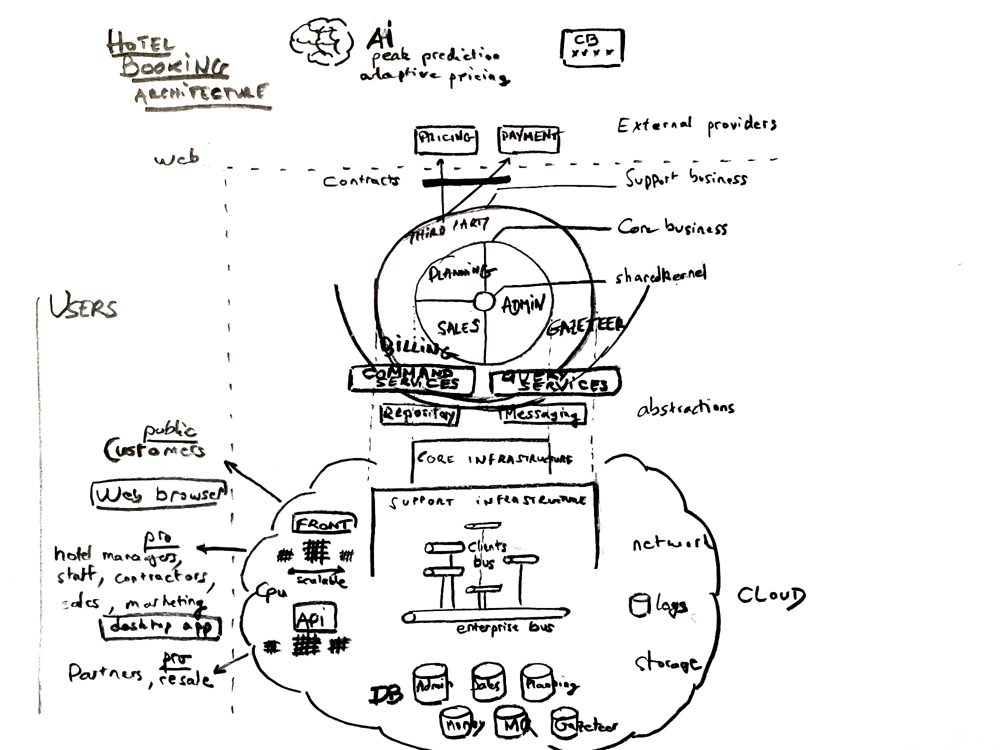
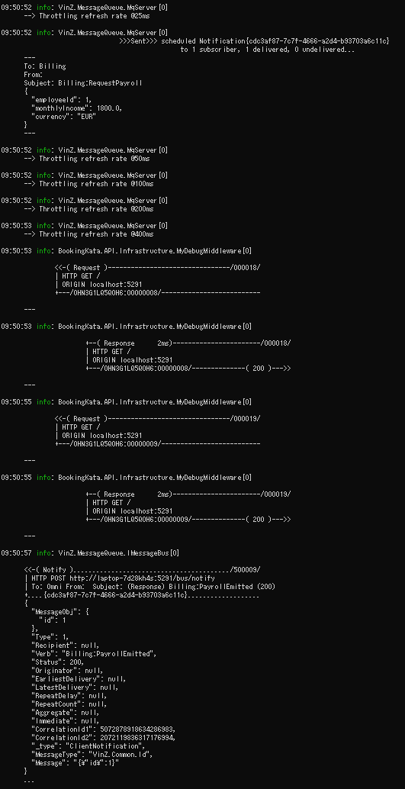
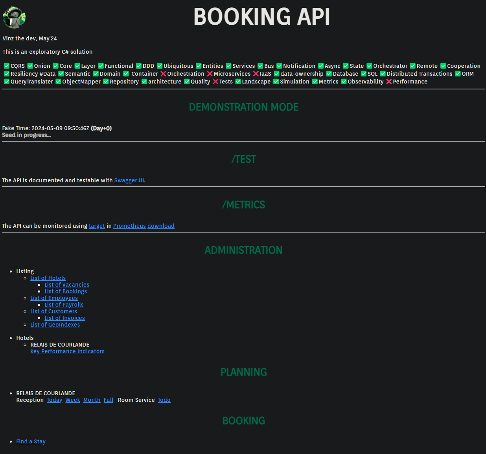
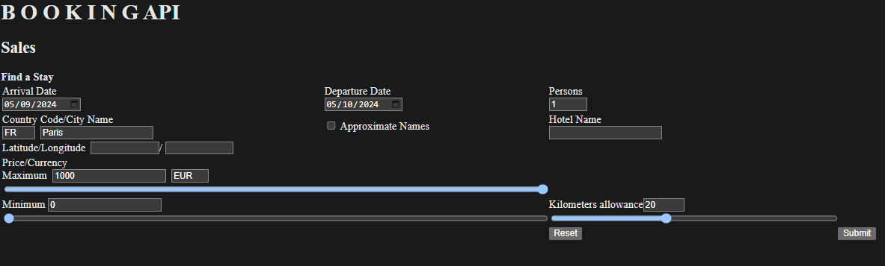
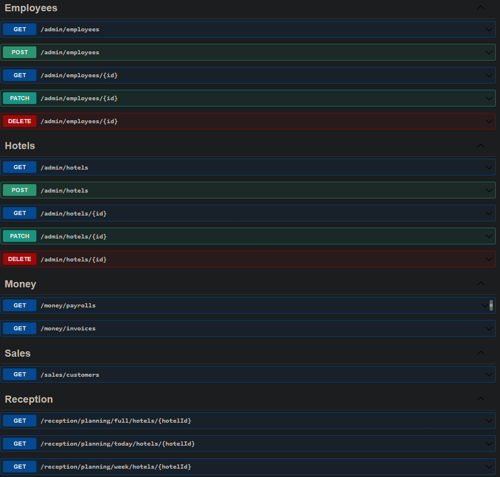
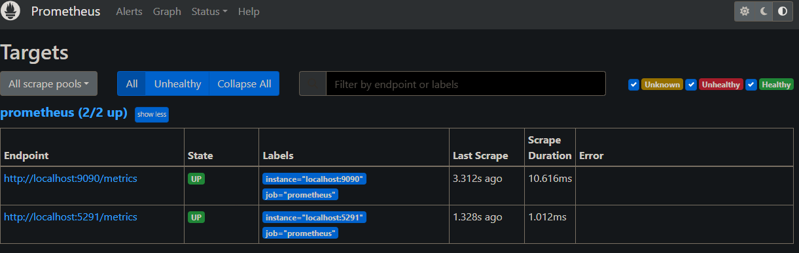

# Booking Bus Kata

{: style="float: left"}
*Մι∩z•thedev* · [Follow](mailto:vinz.thedev@gmail.com)
Published in *Coding* · 6 min read · 1 day ago
___
👏65k 💬321 🔖 ⤴️
___

This is an _exploratory_ C# solution.

It's on my github there: https://github.com/viiinzzz/CQRSBookingKata

Feel free to fork, I appreciate you drop me a word mailto:vinz.thedev@gmail.com for your valuable comments about the topic, I'm still learning, I'll always be learning. Thanks for your support and your good karma ;-)

It started with a minimal kata session @Arolla but since I had time I extended it a bit for fun and pleasure.

I intended to explore _architecture patterns_ a bit more advanced than those I used so far : **Enterprise Bus Messaging** and **Command Query Responsibility Segregation**

I took **Hotel Booking** for the exercise. The goal was not to produce a production grade solution ready for cloud provisioning nor to implement thoroughly the business logic. My goal was to consider the modelling requirements in such an architecture and to cast light on the  prominent matters and advantages.

Production Enterprise Bus Messaging shall ultimately rely on commercial grade services such as  Azure Service Bus, NServiceBus, RabbitMQ, MassTransit, Kafka, Amazon SQS...

Using Bus Messaging best allows achieving _Domain Driven Design_ by ensuring _cohesive logics_ stay together, speak their _ubiquitous language_, being _decoupled_ from the other, _owning their data_, while being able to _communicate_ and _collaborate_. We also see _orchestrating patterns_ coming on top.

It is very satisfactory to grow an _onion-like architecture_, business logics, infrastructure, application. It gives confidence to be able to extend, modernise, replace parts with best control of entanglement, hence time/cost to deliver.

All this thanks to a **bus**, with its **pub/sub** mechanism, and **serialization** facility, over the web hence most probably talking _http_ and _json_ payloads. The communication requirements are various, it shall be **reliable** hence implement _retry policies_ for _unicast_, _broadcast_ and possibly _multicast_, it should be **configurable** hence offering _immediate_, _scheduled_, _multiple_, _recurrent_, _coalescing_ deliveries.

One word about the **asymmetrical** read/write data usage. Why would it be ? Specifically sales are seasonal and subject to peaks. Many high bandwidth public searches (R) and fewer transformation (W). Restricted low bandwidth areas (R/W). The idea is to have specific services called query/command, and specific persistence. This way each channel can be scaled independently. Specific database/technology/caching shall also be used. Of course it implies additional synchronisation mechanism but here again the bus architecture will appreciably ease it.

Once the DDD/Bus architecture is laid down, it becomes pretty obvious **hosting** and **scaling** can easily be reached by adopting a few more **microservices** practices. It leads to **Infrastructure as a Service**, _container_, and _container orchestration_ technologies, such as _docker_ that recently paved the way for easy *cloud formation* thanks to powerful CLI commands. _Docker_ is a serious option to consider to reach **cloud agnosticism**.

Nevertheless, one easily understand the tradeoff for such an agile architecture may be new challenges to cope with, like **observability**, **end-to-end debugging**. So to guard against complex bugs linked to _distributed services_, it is therefore important to ensure a good **code quality** with **TDD** and a **CI/CD**, and to provision also a clever central **log aggregator**.

Another challenge is to correctly tune **orchestration** over the bus, essentially complex operations, like _distributed transactions_, _SAGA patterns_ will imply many async steps. The overall delay will be significantly greater than in a monolithic single database archi. That may be acceptable or not. Batch processing may limit overhead but increase even more latency. The important thing is to clearly identify the time requirement and to locate all the needed data or at least a good enough copy locally for a domain to process fast enough.  

That's it for this article. I envision this bus architecture for medium to large corporate mission where several dev teams may work in parallel for the various departments they deliver functionalities to. The bus would mimic closely what happen in the real world. An architecture to help real workers. An architecture to help company growth. An architecture to serve happy customers !

