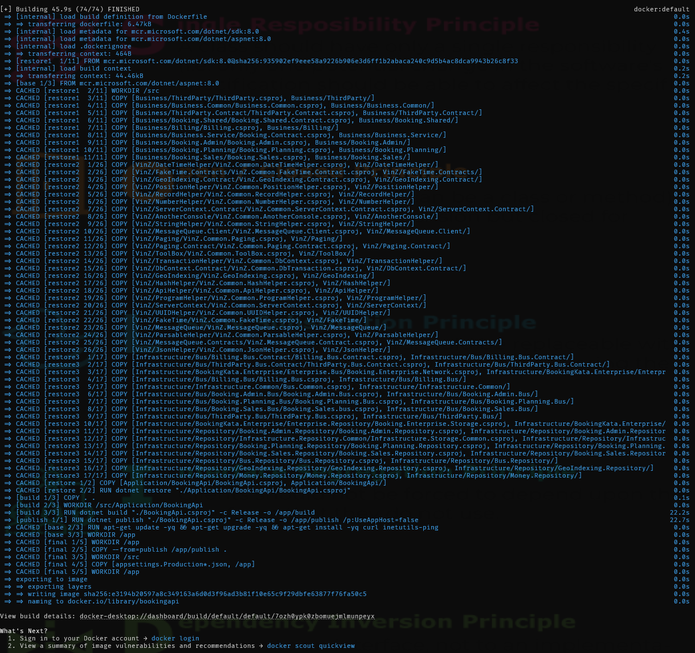

# Optimizing docker image

{: style="float: left"}
*Մι∩z•thedev* · [Follow](mailto:vinz.thedev@gmail.com)
Published in *Coding* · 6 min read · 1 day ago
___
65k 321  猡达
___
`Dive` is a utility to browse docker image https://github.com/wagoodman/dive. 

## Sandwich

Basically a docker image is a sandwich whose slices are called steps and stages.  The `FROM` instruction in the `Dockerfile` says copy that sandwich, I'll customize it with my toppings...

There you go !

 - What was the sandwich made of before I customized it ?
 - Have I really customized it the way I intended ?
 - No hidden craps into it ?
 - Have I not forgot my credit card number into it ?
 
 `Dive` let you lift each slice and check the ingredients the previous cook put in, the ingredients you put as well. Hence you can ponder if all the stuff was really necessary and in case the answer is no, try to remove some to make the sandwich still good but more digestible. Let's trim down the fat and move the belly swiftly !

## Upgrade

I had to upgrade my `Dive` command-line utility, in order to browse my docker images, after my Docker Desktop upgrade to 4.29.

Indeed, docker changed image format to be OCI compatible.
My `Dive` was v0.10.0. Check that with `dive -v`. 
Hopefully v0.12.0 fixes the issue.
Get it with elevated `choco install -y dive --version=0.12.0` 

## dive my csharp project

`dive bookingapi`

- I found the most changing files while experimenting, the `appsettings.*.json`, should advantageously be moved toward the last stage in the dockerfile, after the build and publish, so that all previous stages are restored from cache. Prior to that, I moved the `appsettings.*.json` off the project directory, above indeed, so that they are excluded from the build.
- I noticed some packages have a cohesive way of changing, so I split the `dotnet restore` and `dotnet build` stages in several chunks, ordered by compilation priority or something that would probably help speeding up, like `Business -> Libs -> Infra -> App` 
- I'm still looking for a way to multi-stage plenty-lot-dependencies project build . . .

