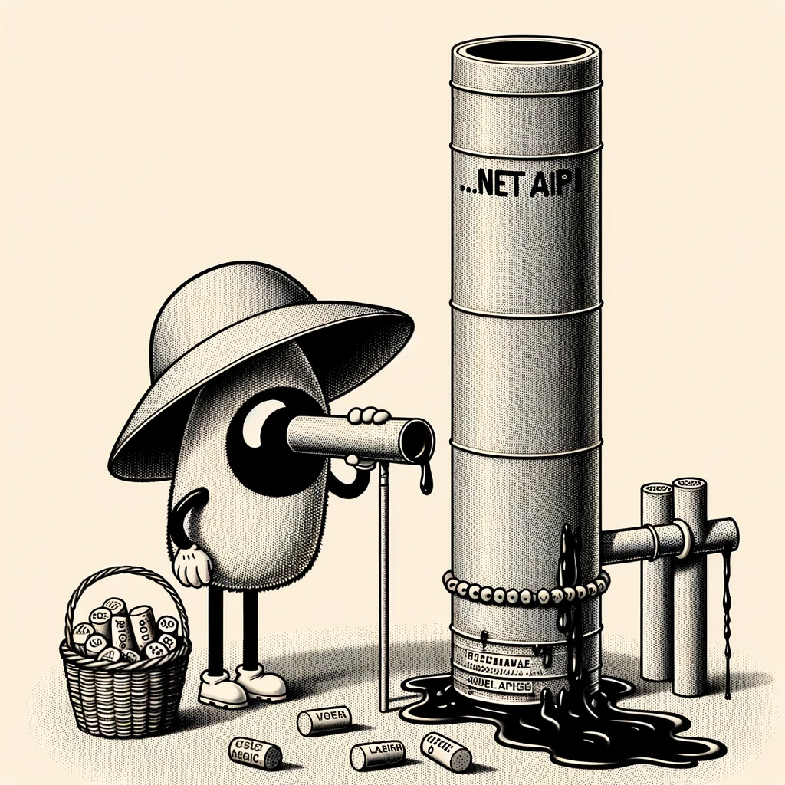

# Debugging an Api pipeline

{: style="float: left"}
*Մι∩z•thedev* · [Follow](mailto:vinz.thedev@gmail.com)
Published in *Coding* · 6 min read · 1 day ago
___
<span style="font-size:2.5em">👏</span>65k <span style="font-size:2.5em">💬</span>321 <span style="font-size:2.5em">🔖</span> <span style="font-size:2.5em">⤴️</span>
___




It is somehow tricky to turn on a probe to inspect the request processing pipeline. Ideally you'd like to capture the **request body** at the very beginning, and the **response body** at the very end of the processing. That way you can assess if the frames comply to your expectation.

I propose a MyDebugMiddleware to be registered as early as possible. Here is an implementation extract that will certainly help many. I myself found the plugging into the streams a bit confusing. Of course this shall not be used in production because there is not efficient buffering or whatsoever addressed. Nonetheless is proves to be salvatory during dev/debug to spot mishaps in the RPC communication.

```csharp
/*
 * Copyright (C) 2024 Vincent Fontaine
 *
 * This program is free software: you can redistribute it and/or modify
 * it under the terms of the GNU General Public License as published by
 * the Free Software Foundation, either version 3 of the License, or
 * (at your option) any later version.
 *
 * This program is distributed in the hope that it will be useful,
 * but WITHOUT ANY WARRANTY; without even the implied warranty of
 * MERCHANTABILITY or FITNESS FOR A PARTICULAR PURPOSE.  See the
 * GNU General Public License for more details.
 *
 * You should have received a copy of the GNU General Public License
 * along with this program.  If not, see <http://www.gnu.org/licenses/>.
 */

public class MyDebugMiddleware
(
    RequestDelegate next,
   /*...shortened...*/
)
{
   /*...shortened...*/

    private static int RequestId = 0;

    public async Task Invoke(HttpContext context)
    {
        var rid = RequestId++;
        var tid = context.Request.HttpContext.TraceIdentifier;
        var t0 = DateTime.Now;

		string? requestBody = null;
		string? responseBody = null;
            
        try
        {
			//read the request body stream (--> capture request body)
			
			MemoryStream? requestBodyMemoryStream;
			if (context.Request.Body.CanRead)
			{
				requestBody = await new StreamReader(context.Request.Body).ReadToEndAsync();
				
			//and rewrite body it into our own rewindable buffered stream that will replace original one.
			//ie. original stream would not have allowed being read twice
			
				requestBodyMemoryStream = new MemoryStream();
				{
					var requestBodyCopy = new StreamWriter(requestBodyMemoryStream, Encoding.UTF8);
					await requestBodyCopy.WriteAsync(requestBody);
					await requestBodyCopy.FlushAsync();
					requestBodyMemoryStream.Seek(0, SeekOrigin.Begin);

				}
				context.Request.Body = requestBodyMemoryStream;
			}

			logger.LogInformation(@$"
	<<-( Request )--------------------------------/{rid:000000}/
	| {context.Request.Scheme.ToUpper()} {context.Request.Method} {context.Request.Path}{context.Request.QueryString}
	| ORIGIN {context.Request.Host}
	+---/{tid}/--------------------------
{requestBodyObj}
---");

		//before next middleware happens, replace the response body stream with our own rewindable buffered stream (--> prepare capture response body)
		
		var originalBodyStream = context.Response.Body;
		await using var responseBodyMemoryStream = new MemoryStream();
		context.Response.Body = responseBodyMemoryStream;

		//let the pipeline complete -or not-
		//
		await next(context);
		//
		//

		//read the response body stream.
		//ie. original write stream would not have allowed being read
		
		responseBodyMemoryStream.Seek(0, SeekOrigin.Begin);
		responseBody = await new StreamReader(context.Response.Body, Encoding.UTF8).ReadToEndAsync();
		responseBodyMemoryStream.Seek(0, SeekOrigin.Begin);

		var dt = (DateTime.Now - t0).TotalMilliseconds;

		logger.LogInformation(@$"
			+--( Response {$"{dt,6:#####0}"}ms)-----------------------/{rid:000000}/
			| {context.Request.Scheme.ToUpper()} {context.Request.Method} {context.Request.Path}{context.Request.QueryString}
			| ORIGIN {context.Request.Host}
			+---/{tid}/--------------( {context.Response.StatusCode:000} )--->>
{context.Response.ContentType ?? "text"}
{responseBody}
---( Request )
{requestBody}
---");

            await responseBodyMemoryStream.CopyToAsync(originalBodyStream);
            context.Response.Body = originalBodyStream;
        }
        catch (OperationCanceledException ex)
        {
            context.Response.StatusCode = (int)HttpStatusCode.RequestTimeout; //408

            var dt = (DateTime.Now - t0).TotalMilliseconds;

            logger.LogWarning(@$"
                !--( Canceled {dt,6:#####0}ms)-----------------------/{rid:000000}/
                | {context.Request.Scheme.ToUpper()} {context.Request.Method} {context.Request.Path}{context.Request.QueryString}
                | ORIGIN {context.Request.Host}
                !!!!!{tid}!!!!!!!!!!!!!!( {context.Response.StatusCode:000} )!!!!!X
Failure cause by {ex.GetType().Name}:
{ex.Message}
{ex.StackTrace}
---");
        }
        catch (Exception ex)
        {
            context.Response.StatusCode = (int)HttpStatusCode.Conflict; //409

            if (ex.InnerException != null) ex = ex.InnerException;

            var dt = (DateTime.Now - t0).TotalMilliseconds;

            logger.LogError(@$"
                !--( Aborted {dt,6:#####0}ms)------------------------/{rid:000000}/
                | {context.Request.Scheme.ToUpper()} {context.Request.Method} {context.Request.Path}{context.Request.QueryString}
                | ORIGIN {context.Request.Host} 
                !!!!!{tid}!!!!!!!!!!!!!!( {context.Response.StatusCode:000} )!!!!!X
Failure cause by {ex.GetType().Name}:
{ex.Message}
{ex.StackTrace}
---");
        }
    }

}
```