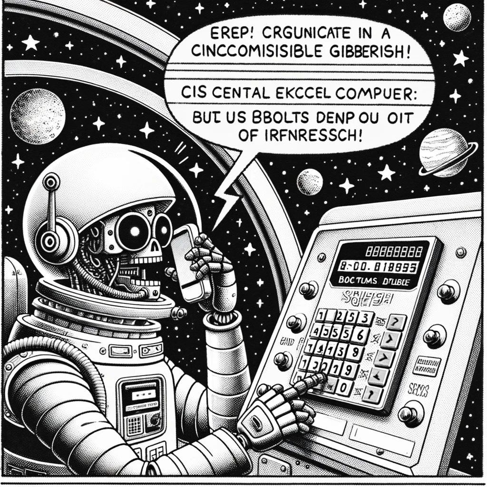

# C# Language Tips 1

{: style="float: left"}
*Մι∩z•thedev* · [Follow](mailto:vinz.thedev@gmail.com)
Published in *Coding* · 6 min read · 1 day ago
___
<span style="font-size:2.5em">👏</span>65k <span style="font-size:2.5em">💬</span>321 <span style="font-size:2.5em">🔖</span> <span style="font-size:2.5em">⤴️</span>
___



There are really nice ways to express ourselves in C#.

Here are a couple of them I like.

## record / with

```csharp
public record class Location(int PositionX, int PositionY)
{
    Location MoveEast() => this with
    {
        PositionX = PositionX + 1
    };
}
```

## key/value pair deconstructor (C#7)

``` csharp
foreach ((var p, var quantity) in _productQuantities)
```

## implicit cast

```csharp
    public static implicit operator Location(
        (int PositionX, int PositionY) location
    )
        => new(location.PositionX, location.PositionY);
```

## functional-style switch

```csharp
public RoverStatus DryRun(MoveEnum move) => move switch
    {
        MoveEnum.R => TurnRight(),
        MoveEnum.L => TurnLeft(),
        MoveEnum.M => Direction switch
        {
            DirectionEnum.N => MoveNorth(),
            DirectionEnum.S => MoveSouth(),
            DirectionEnum.E => MoveEast(),
            DirectionEnum.W => MoveWest(),
            _ => throw new NotImplementedException()
        },
        _ => throw new NotImplementedException()
    };
```

## obsolete

```csharp
    [Obsolete("deprecated, please use blabla instead.")]
```

## regex named capture groups

```csharp
public enum DirectionEnum { N, W, S, E }

private static readonly string AllDirections = 
    Enum.GetValues(typeof(DirectionEnum))
        .Cast<DirectionEnum>().Select(x => $"{x}")
        .Aggregate((x, y) => x + y);

private static readonly Regex StatusRx =
        new(@$"(?<PositionX>[+-]?\d+) +(?<PositionY>[+-]?\d+) +(?<Direction>[{AllDirections}])");
```

## record with validation (to be extended)

```csharp
public abstract record RecordWithValidation
{
    protected RecordWithValidation() => Validate();
    protected virtual void Validate() { }
}
```

## N-fluent

```csharp
 [Fact]
public void status_of_new_Rover__by_string()
{
    var controller = new MissionController("9 9");
    var rover = controller.AddRover("5 5 E");
    Check.That(rover.PrintDispatch()).IsEqualTo("5 5 E");
}
```

## fluent assertions

```csharp
[Theory]
[InlineData(0)]
[InlineData(-1)]
public void width_zero_or_negative__by_value(int Width)
{
    int MaximumX = Width - 1, MaximumY = 5;
    FluentActions.Invoking(() => new MissionController(MaximumX, MaximumY))
        .Should().Throw<Exception>()
        .WithMessage("plateau has invalid corner -- MaximumX must be 1 or greater odd");
}
```

## hashcode

using tuples, no need to do complex prime xor

```csharp
public override int GetHashCode() => (X, Y, Z).GetHashCode();
```
