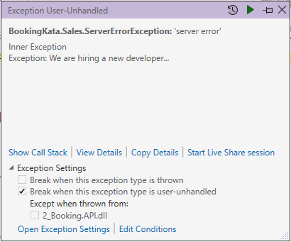

# C# Language Tips 3

{: style="float: left"}
*Մι∩z•thedev* · [Follow](mailto:vinz.thedev@gmail.com)
Published in *Coding* · 6 min read · 1 day ago
___
<span style="font-size:2.5em">👏</span>65k <span style="font-size:2.5em">💬</span>321 <span style="font-size:2.5em">🔖</span> <span style="font-size:2.5em">⤴️</span>
___



Here are the fishes I angled while coding. You can fry them the way you like, just share with the community, ie. Stackoverflow is my favorite ;-)

_Foreword_
'EF' for non-initiated ones is diminutive for 'Entity Framework', the reference ORM for .Net

## primary constructors

less typing, very convenient for dependency injection

```csharp
public class MyService
{
    private readonly IRepository _repo;

    public MyService(IRepository repo)
    {
        _repo = repo;
    }
}

//turns into

public class MyService(IRepository repo)
{

}
```

## EF without state management

By default EF tracks all the changes, for good (what do you expect of an ORM after all?) and for worse (performance...)
Some design are simply not compatible with EF default behavior, hence needing to tune it to be much more like a query builder than a full-fledged ORM.

```csharp

//find+detach
var thing = _dbContext.Things.Find(thingId);
_dbContext.Entry<TThing>(thing).State = EntityState.Detached;

//add+detach
var entity = _dbContext.Add(thing)
_dbContext.SaveChanges();
entity.State = EntityState.Detached;

//query+detached
public IQueryable<TThing> Things 
	=> _dbContext.Things.AsNoTracking();
```

# EF Exceptions

```csharp
//enable meaningful EF exception message, don't! if sensitive...
public class MyContext : DbContext
{
    protected override void OnConfiguring(DbContextOptionsBuilder builder)
    {
        builder.EnableSensitiveDataLogging();
    }
}
```

# Transactions

```csharp

//1.newer TransactionScope
using var scope = new TransactionScope()
...
scope.Complete();

//--vs--

//2.older BeginTransaction
using var transaction = _back.Database.BeginTransaction();
...
 transaction.Commit() 
 /*or*/ transaction.Rollback();


//   TransactionScope is auto rollback on fail
try
{
    using var transactionScope = new TransactionScope();
    
	// if success so far, commit the transaction
	transactionScope.Complete();
}
catch (Exception ex)
{
    // transaction will be rolled back if exception occurs
}
//   TransactionScope does async
using var scope = new TransactionScope(
						TransactionScopeAsyncFlowOption.Enabled)
await context.Things.ToListAsync().ConfigureAwait(false);
//   TransactionScope allows easier nested scope in scope

//BUT TransactionScope not supported by all db, ie. sqlite,
//    so BeginTransaction is more reliable
```

## Parsable

That's for .NET Core API to be able to parse nullable int, which is not as trivial as it seems

```csharp
    booking.MapGet("/", (
    ...
            [FromQuery(Name = "pricemin")] NullableInt priceMin,
            [FromQuery(Name = "pricemax")] NullableInt priceMax,
    ...
            )
        => ...
```


```csharp
public class NullableInt : IParsable<NullableInt>
{
    public int? Value { get; init; } = null;

    public static NullableInt Parse(string value, IFormatProvider? provider)
    {

        if (!TryParse(value, provider, out var result))
        {
            throw new ArgumentException("Could not parse supplied value.", nameof(value));
        }

        return result;
    }

    public static bool TryParse(string? value, IFormatProvider? provider, out NullableInt nullableInt)
    {
        if (string.IsNullOrWhiteSpace(value))
        {
            nullableInt = new NullableInt();

            return true;
        }

        if (int.TryParse(value, out var intValue))
        {
            nullableInt = new NullableInt() { Value = intValue };

            return true;
        }

        nullableInt = new NullableInt();

        return false;
    }
}
```

## Producer loop : yield

`yield return`, `yield break`, `yield continue`, same as traditional `return`, `break`, `continue` but operates as `IEnumerable`. That's interesting because the data is produced just-in-time and not in bulk, hence preserving resources and reducing latency.

```csharp

public IEnumerable<Item> GetItems()
{
    for(var i = 0; i < 10; i++)
    {
        yield return new Item
        {
            Id = i
        };
    }
}
```

## Funny C#8+ indexers

```csharp

var numbers = new int[] { 1, 2, 3, 4, 5 };

//C#8+ indexers

numbers[^1] // numbers[length-1]

numbers[2..^3];
numbers[..^3];
numbers[2..];
numbers[..];

//funny but not always very useful

```

# Range to replace for loop

```csharp
for(int i = start; i < count; i++) ...

//changed for

Enumerable
	.Range(start, count)
	.ForEach(i => ... 
```

For example, let's convert a string of hex characters to bytes (we need 2 hex digits to make up 1 byte and repeat...)

```csharp
ret = Enumerable
	.Range(0, hex.Length)
	.Where(i => i % 2 == 0)
	.Select(i => Convert.ToByte(hex.Substring(i, 2), 16))
	.ToArray();
```

## To be or not to be Nullable...

Thing is nullable
int is not nullable
int? is nullable
...

```csharp  
public static bool IsNullable(this Type ClrType)
{
	if(!ClrType.IsValueType) 
		return true; // Reference Type  
	
	if (Nullable.GetUnderlyingType(ClrType) != null)
		return true; // Nullable<T>
		
	return false;    // Value Type  
}
```

## Underlying type

```csharp  
  public static Type GetUnderlyingClrType(this Type )  
        {  
            get  
            {  
                if (ClrType == typeof(string))  
                {  
                    return ClrType;  
  
                }  
                if (!IsNullable)  
                {  
                    return ClrType;  
                }  
  
                return Nullable.GetUnderlyingType(ClrType);  
            }  
        }
```

## Range enumeration

You like range from, count ?
You want range from, to ?

```csharp
public static class EnumerableHelper
{
    public static IEnumerable<int> RangeTo(this int from, int to)
    {
        return Enumerable.Range(from, to - from + 1);
    }
```

## Random order enumeration

```csharp
public static class EnumerableHelper
{
    private static Random Random = new Random();

    public static IEnumerable<T> AsRandomEnumerable<T>(this IEnumerable<T> collection)
    {
        var scrambled = collection
            .OrderBy(item => Random.Next());

        foreach (var item in scrambled)
        {
            yield return item;
        }
    }
```

# Hash-32 not enough

Sometimes you feel you should extend the yard were you throw peebles into, to avoid possible wreck... that does not mean you shouldn't double-check collisions....

Here is a way to get Hash-64 for a string

```csharp
public static class HashHelper
{

    private static BlockingCollection<SHA256> Shas = NewShaCollection();

    private static BlockingCollection<SHA256> NewShaCollection()
    {
        var ret = new BlockingCollection<SHA256>(Environment.ProcessorCount);
        for (var i = 0; i < ret.BoundedCapacity; i++)
        {
            ret.Add(SHA256.Create());
        }

        return ret;
    }

    private static T? GetASha<T>(Func<SHA256, T?> use)
    {
        var sha = Shas.Take();

        Exception? ex = default;
        T ret = default;
        try
        {
            ret = use(sha);
        }
        catch (Exception ex_)
        {
            ex = ex_;
        }

        Shas.Add(sha);

        if (ex != null)
        {
            throw ex;
        }

        return ret;
    }

    public static long GetHashCode64(this string str)
    {
        var bytes = Encoding.ASCII.GetBytes(str);

        return GetHashCode64(bytes);
    }

    public static long GetHashCode64(params byte[][] byteArrays) 
        => GetHashCode64(byteArrays
            .Select(arr => arr.AsEnumerable())
            .Aggregate((arr1, arr2) => arr1.Concat(arr2))
            .ToArray());

    public static long GetHashCode64(this IEnumerable<byte> bytes) 
        => GetHashCode64(bytes.ToArray());

    public static long GetHashCode64(this byte[] bytes) => GetASha(aSha =>
    {
        var sha = aSha.ComputeHash(bytes); //32 bytes
        ulong uhash = 0;

        for (int i = 0; i < 4; i++)
        {
            for (int j = 0; j < 8; j++)
            {
                var b = sha[i * 8 + j];

                uhash ^= (ulong)b << j * 8;
            }
        }

        var hash = unchecked((long)uhash + long.MinValue);

        return hash;
    });
}
```

## DateTime rounded to the second

```csharp
    private static readonly long HalfSecondTicks = TimeSpan.TicksPerSecond / 2;

    public static DateTime RoundToTheSecond(this DateTime date)
    {
        var ret = date;

        var fractionalTicks = ret.Ticks % TimeSpan.TicksPerSecond;

        ret = ret.AddTicks(-fractionalTicks);

        if (fractionalTicks >= HalfSecondTicks)
        {
            ret = ret.AddTicks(TimeSpan.TicksPerSecond);
        }

        return ret;
    }
```

# Lost in Translation

EF, do you copy that ?

```csharp
//query the IQueryable

if (query.LostInTranslation(out var sql, out var translationError))
{
	throw new ServerErrorException(new Exception("We are hiring a new developer..."));
}


public static bool LostInTranslation<TEntity>
(
	this IQueryable<TEntity> query,
	out string? sql,
	out string? translationError
) 
	where TEntity : class
{
	try
	{
		sql = query.ToQueryString();
		translationError = null;

		return false;
	}
	catch (Exception ex)
	{
		sql = null;
		translationError = ex.Message;

		Console.Error.WriteLine($@"Lost in translation!
{translationError}");

		return true;
	}
}
```


# Program information

```csharp
//That helper parse and print Program name, version and build configuration
//  ie. Booking.API.exe 1.24.3.29 (Debug)

//tested in windows
//not tested in mac, linux, please improve

using System.Diagnostics;
using System.Reflection;
using System.Text.RegularExpressions;

namespace VinZ.ToolBox;

public record ProgramInfo(string? ExeName, string ExeVersion, string BuildConfiguration)
{
    public void Print()
    {
        Console.WriteLine(@$"
{ExeName} {ExeVersion} ({BuildConfiguration})
");
    }


    public static ProgramInfo Current 
        
        => GetProgramInfo(Assembly.GetEntryAssembly());


    public static ProgramInfo GetProgramInfo(Assembly assembly)
    {
        var dllPath = assembly.Location;
        var rx = new Regex(@"^(?<path>.*)\.dll$");
        var match = rx.Match(dllPath);
        var exePath = !match.Success ? default : match.Result("${path}.exe");
        var exeName = exePath == default ? default : Path.GetFileName(exePath);
        var exeVersion = exePath == default ? "???" : System.Diagnostics.FileVersionInfo.GetVersionInfo(exePath).FileVersion;

        var buildConfiguration = IsDebugBuild(assembly) ? "Debug" : "Release";

        return new ProgramInfo(exeName, exeVersion, buildConfiguration);
    }

    public static bool IsDebugBuild(Assembly assembly)
    {
        return assembly
            .GetCustomAttributes(false)
            .OfType<DebuggableAttribute>()
            .Any(attr => attr.IsJITTrackingEnabled);
    }
}
```

### discard assignment

```csharp
_ = who_the_hells_cares_about;

_ = 2024; //roughly means, let's forget 2024 ...

//much more useful is tuple partial deconstruction

var (_, fun, _) = tuple; //do your shopping !
```


### switch regex

```csharp
var str = "yummy";

switch (str)
{                
	case var s when Regex.IsMatch(s, "yucky"):
		something = 1;
		break;

	case var s when Regex.IsMatch(userName, "yummy"):
		something = 2;
		break;

	default:            
		break;
}    
```