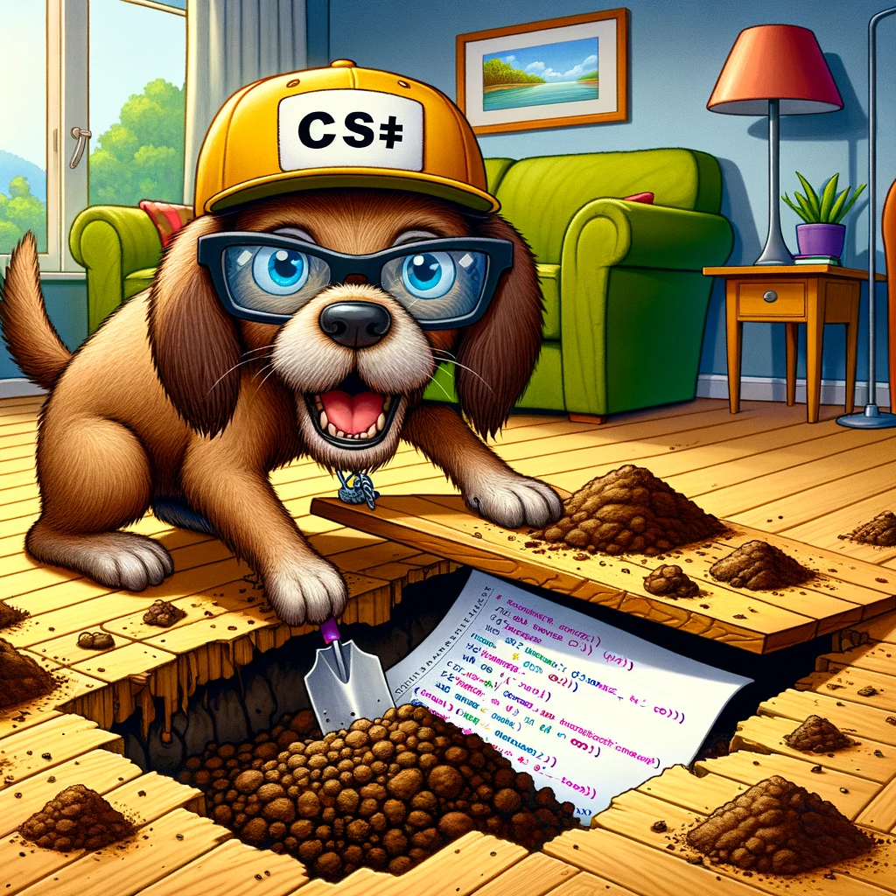

# C# Language Tips 2

{: style="float: left"}
*Մι∩z•thedev* · [Follow](mailto:vinz.thedev@gmail.com)
Published in *Coding* · 6 min read · 1 day ago
___
<span style="font-size:2.5em">👏</span>65k <span style="font-size:2.5em">💬</span>321 <span style="font-size:2.5em">🔖</span> <span style="font-size:2.5em">⤴️</span>
___



While investigating CQRS, I angled a couple of nice tips.


## primary constructors

less typing, very convenient for dependency injection

```csharp
public class QueryRoomAvailabilityService
{
    private readonly IQueryable<RoomAvailability> _roomAvailabilities;

    public QueryRoomAvailabilityService(IQueryable<RoomAvailability> roomAvailabilities)
    {
        _roomAvailabilities = roomAvailabilities;
    }
}
```

becomes

```csharp
public class QueryRoomAvailabilityService(IQueryable<RoomAvailability> roomAvailabilities)
{

}

```

but unhandy when the class inherits a base constructor.

## compare strings insensitive to case and diacritics

```csharp
public int? FindHotel(string hotelName, bool approx)
{
	var exactMatch = back.Hotels

		.FirstOrDefault(hotel => 0 == string.Compare(
			hotel.HotelName,
			hotelName,
			CultureInfo.CurrentCulture, 
			CompareOptions.IgnoreCase | CompareOptions.IgnoreNonSpace | CompareOptions.IgnoreSymbols))

		?.HotelId;

	if (exactMatch != default)
	{
		return exactMatch;
	}

	if (!approx)
	{
		return default;
	}

	var approxMatch = back.Hotels

		.FirstOrDefault(hotel => -1 != CultureInfo.InvariantCulture.CompareInfo.IndexOf(
			hotel.HotelName,
			hotelName,
			CompareOptions.IgnoreCase | CompareOptions.IgnoreNonSpace | CompareOptions.IgnoreSymbols))

		?.HotelId;

	return approxMatch;
}
```

## Emptyness

```cscharp

T[] array = Array.Empty<T>();

string a = string.Empty;

```
