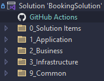
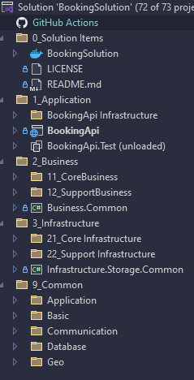
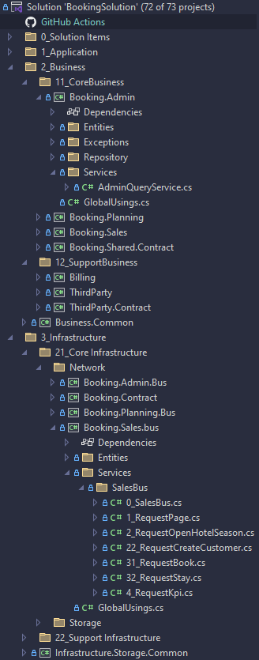
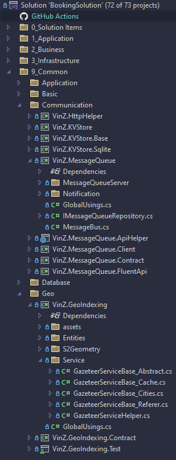
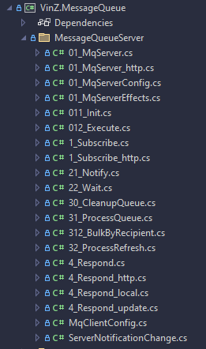

# Do you scream ?

{: style="float: left"}
*Մι∩z•thedev* · [Follow](mailto:vinz.thedev@gmail.com)
Published in *Coding* · 6 min read · 1 day ago
___
👏65k 💬321 🔖 ⤴️
___

## ⨁ Program1 ⇦😠 _single folder_

*Imagine you come to a restaurant and the full-course menu looks like this:*

 - Blini
 - Bouchée
 - Camembert
 - Champagne
 - Chèvre
 - Côtes du Roussillon Villages
 - Dauphinois
 - Emmental
 - Gratin
 - Herbes de Provence
 - Julienne
 - Jurançon sec
 - Légumes
 - Orphée frit
 - Pinot noir de Bourgogne
 - Porc
 - Roquefort
 - Salade de fruit
 - Salade verte
 - Saumon
 - Reine
⇓
⇓ 😣 _shit-load unordered files_ 
⇓
... certainly the cook knows how to arrange these,
... for sure the head waiter would give you advices, but he's not coming yet...
... at first sight, seeing no architecture ❌ , a menu conveying no story-telling ❌ , long to grasp ❌

how would you feel ?

❌❌❌ To me, it's not appealing while it could be a succulent course indeed, how unfortunate!

At best one can be **curious**, or one can be **dubious**; at worse, if on a hurry for example, it's a **no-go**, or it could be **misleading** making **wrong assumptions**... very bad.

It provides no useful **reading keys**, no **progressive reading**.

## ⨁ Program2

*What about the same menu rewritten like this:*
### ⨁ Apéritif ⇦☺️ _headlines_ 
- Boisson ⇦☺️ _sub folders_ 
	- Champagne
- Blini de Saumon

　　　～～～
### ⨁ Hors d'oeuvre
- Bouchée à la Reine
- Boisson
	- Pinot noir de Bourgogne

　　　～～～
### ⨁ Fish
- Filet d'Orphée frits
	 - accompagné de sa Julienne de Légumes
- Boisson
	- Jurançon blanc sec

　　　～～～
### ⨁ Main Course
 - Porc aux Herbes de Provence
	 - accompagné de son Gratin Dauphinois
 - Boisson
	 - Côtes du Roussillon Villages

　　　～～～
### ⨁ Salade verte

　　　～～～
### ⨁ Cheese
- Farandole aux 4 fromages
	 - Camembert
	 - Chèvre
	 - Emmental
	 - Roquefort
### ⨁ Dessert
 - Salade de fruit

✅✅✅ It tells you're sitting a great table, that you will spend a pleasant evening with your family/friends/colleagues, travelling various french landscapes, between sea and ocean, experimenting subtle food pairings, easing business tights, forging memories together, celebrating achievements...

I come to my point.

## 📣Screaming architecture

A program whose architecture is 📣 **screaming** is a **progressive documenting** way to **myself** first! and to the rest of the 🧑‍🤝‍🧑 **team**, and to newly **onboarded** staff, or to occasional **partners**.

The one I am 6 months after I started a huge project surely is a different me. 

Leaving a 🧼**clean solution** with 🧅 **onion-like organized projects**,
leaving a 🗂️ **clean folder hierarchy** 
and a ✍️ **clean file naming** 

is *success key* to keep both a **deep** and a **top-level** understanding of the code **at every moment**.

### CUSP

A good balance between No / and disturbing high-frequency refacto, should be considered. 

Breaking the CUSP 🤝Common Understanding Stability Principe is an issue. On one hand you should not fear 🪠refacto badly structured solutions (at least before it's too late), on the other hand you should have enough (◕‿◕) vision to give stability for a 🕖reasonable time.

That links to major/minor versioning, backward compatibility matters.

## 📣Screaming example

Open the solution, what is it doing ? ok, good, we have an 📣 app doing some 📣 business, using an 📣 infrastructure, and some 📣 common libraries.

Good to see an onion-like organized solution. It's hinting we certainly find cohesive code and decoupling.

Let's open first-level. Notice folder names may have numbering; that trick is great because our linear top-to-down reading first meet the most important sub item, plus 📣it's telling a story.

  
  Indeed we have a 📣booking API, maybe if we open the test project, it will explain what it does 📣end-to-end. Its business has 📣core activities and 📣support as well; same for the infrastructure. The technical libs mention we're persisting in 📣databases and using 📣geo-location, and it's 📣communicating (maybe is it a distributed application?)

Let's open the business. We're eager to understand the business value first, aren't we ?

Ok so it's a pretty well feature-packed solution for 📣admin, 📣planning, 📣sales, 📣billing of hotel rooms, is it?

Let's dive into the technical libraries:

Indeed the guy has pulled out technical, generic, reusable stuff into very 📣specific purpose small libraries. Modularity is good for decoupling.

As we thought, indeed, it is a distributed application, looks like it 📣communicates over an enterprise 📣bus propelled with a 📣Message Queue Server on 📣HTTP, hence it should run on any cloud/network. Interestingly, 📣geo-location is based on the 📣S2 cells, there is an all-purpose 📣gazeteer.

Let's dive in the Message Queue Server:

Hopefully the 📣file numbering helps reading what the class does, and in which order. This can be achieved using `partial`.

## VS Tricks

### solution folders

- Don't forget Visual Studio **solutions can have logical folders** to help adding orthogonal classifications, such as functional, technical, business, common, etc...
- **Projects naming** also usually closely follow **namespaces.**

### `partial`

Now my advice which is not so common maybe, is to :

- **seriously abuse of `partial` classes**, 
- and using subfolder names after class names when class grow
- and partial filenames with numbering
- and append `_purpose` to convey additional intention. 

### `#region`

I am more dubious regarding the practice consisting of enclosing scopes in `#region`. 

Just like `partial` can make new class popping up, `#region` can make methods popping up as well.
However I have seen so many legacy code where `#region` were plethorically used for the sole purpose of hiding shit under the carpet (the collapsed form), that for me it smells like a lack of refacto accumulation.

### 🧅onion explorer

Truly, I dream💭 of a solution explorer that is not the traditional file tree, but a 2D, or 3D onion explorer, with easy dive into, and cohesion/coupling vision feature. This is a call to VS extension inventors !!!
I believe that would be a great addition. 

## Conclusion

A screaming architecture also is part of the living documentation initiative.

- Just like a co-localized test pyramid does provide developers a good grasp on the various artefacts objectives.
- Just like marking attributes (AOP), in addition to providing functionality, could hint about the creational, structure, tactical, design patterns being used.
- Just like, most importantly, any variable, method, class, project should be carefully named and well scoped.

Always do care to maximize Intention transmission, and provide a gradual path to it.
