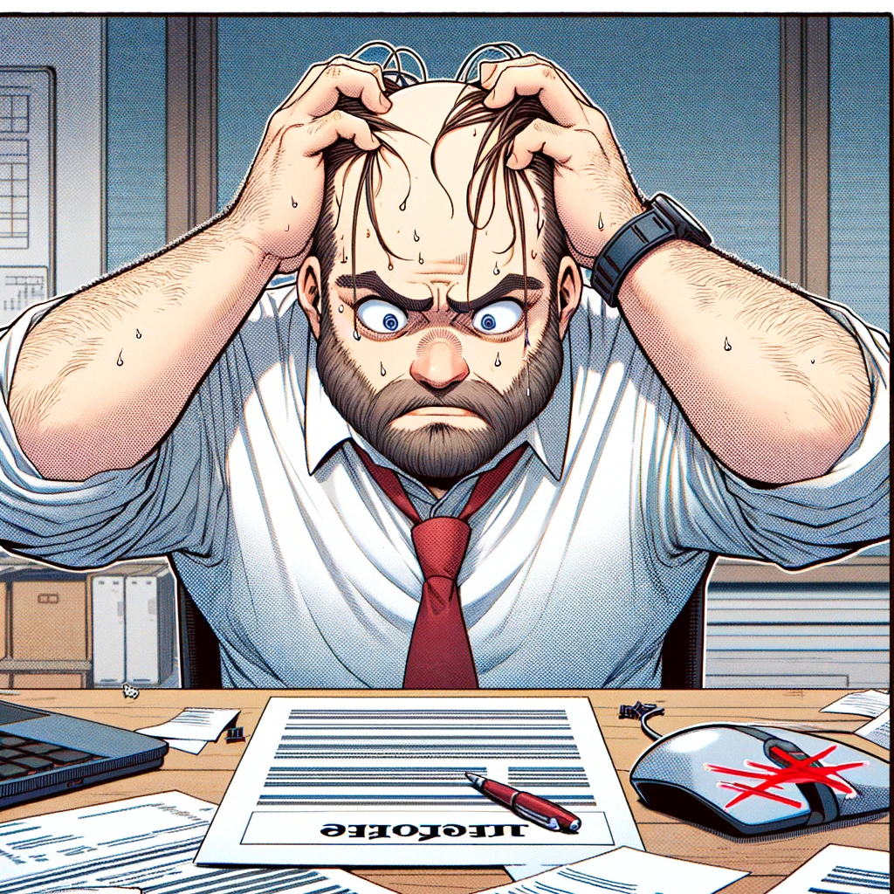

{: style="float: left"}
[back to home](https://viiinzzz.github.io/HOME)

# Branch pulling oblivion

```shell
git branch↵
* master
```

 Oops! I'm on master...

```shell
git status↵
On branch master
Your branch is up to date with 'origin/master'.

Changes not staged for commit:
  (use "git add/rm <file>..." to update what will be committed)
  (use "git restore <file>..." to discard changes in working directory)
        modified:   xxxx
        deleted:    xxxx        
```

...and there are many changes



```shell
git switch -C feature2↵
Switched to a new branch 'feature2'
```

Ah. Relieved. I saved my change into a new branch.
