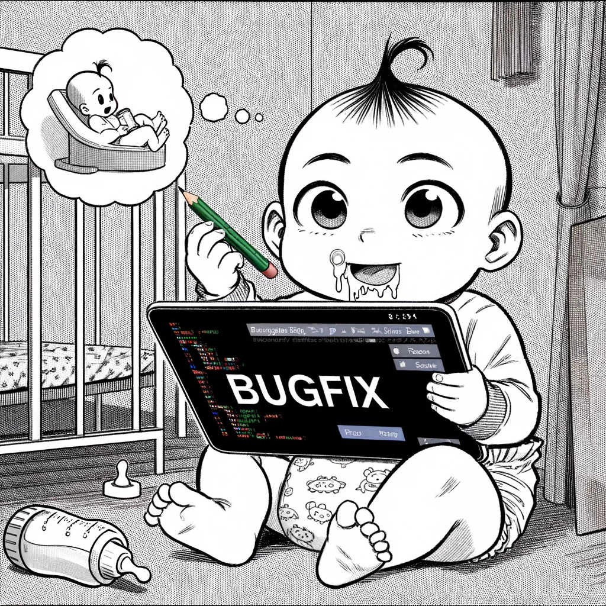

{: style="float: left"}
[back to home](https://viiinzzz.github.io/HOME)

# Branch renaming

```shell
git branch↵
* budfix
```

 Oops! I misnamed...



## Local rename first

```shell
# local
git branch -m bugfix↵

# remote
git push origin --delete budfix↵
git push origin -u bugfix↵
```

## Checking

```shell
git branch -all↵
* bugfix
```

> [!WARNING]
> Below needs to be verified
>
## Remote rename first

```shell
# whatever branch I'm on
git branch -m budfix bugfix↵
git fetch origin↵

# set upstream to
git branch -u origin/bugfix bugfix↵
git remote set-head origin -a↵
```
