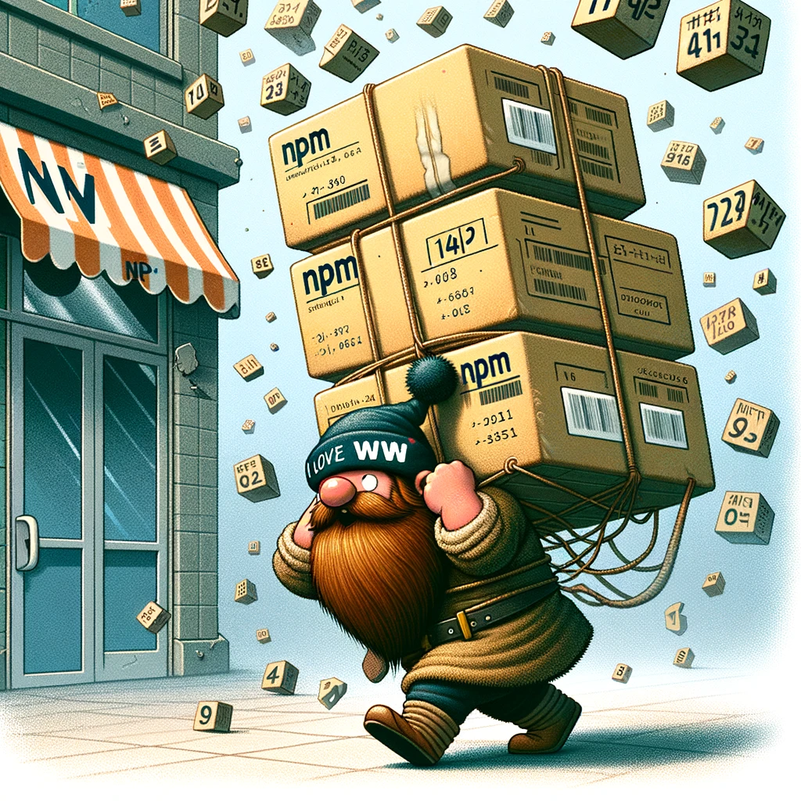

# Publish a NPM package

{: style="float: left"}
*Մι∩z•thedev* · [Follow](mailto:vinz.thedev@gmail.com)
Published in *Coding* · 6 min read · 1 day ago
___
<span style="font-size:2.5em">👏</span>65k <span style="font-size:2.5em">💬</span>321 <span style="font-size:2.5em">🔖</span> <span style="font-size:2.5em">⤴️</span>
___

➔ [Reference on NPMjs](https://docs.npmjs.com/creating-and-publishing-scoped-public-packages)

## using yarn on npm.js

Edit the <kbd>.yarnrc</kbd> file

```rc
registry: https://registry.npmjs.org/
```

## check package before publish

```shell
npm publish --dry-run↵
npm publish --dry-run subdir↵
```



## publish package

```shell
# publish package to npmjs.com
npm publish↵

# publish private package
#To use private packages, you must have a [paid user or organization account](https://www.npmjs.com/pricing)
npm publish --access private↵

# package as .tar (https://docs.npmjs.com/cli/v8/commands/npm-pack)
npm pack↵

# published package information
# display **latest version** available on the registry
npm view packageName version↵
```

## display package info

```shell
# display **all versions** available on the registry
npm view packageName versions↵
  
# get owner
npm owner ls packageName@version↵

# local packages
# display **local version**
npm list packageName↵

# display **all local packages**
npm list --depth=0 | awk '{print $2}'↵
npm list --depth=0 | awk '{print $2}' | grep @user/↵
```
