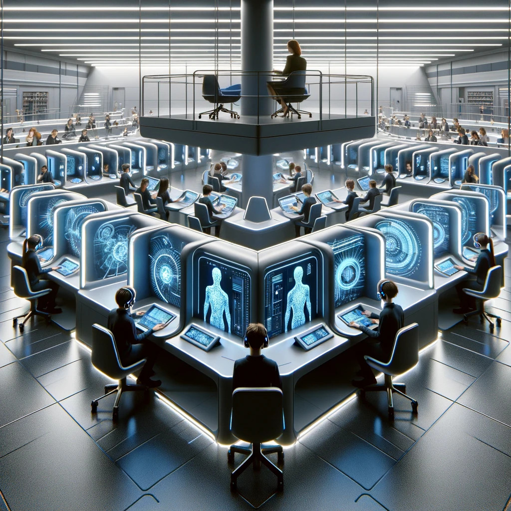
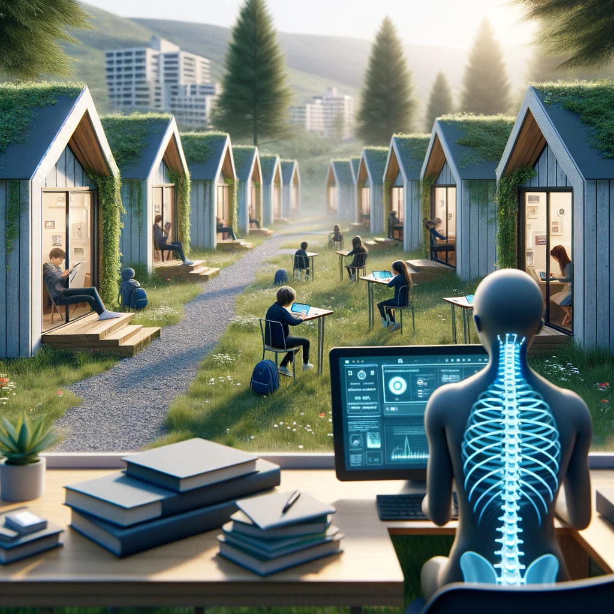

# The Future of Education

{: style="float: left"}
*Մι∩z•thedev* · [Follow](mailto:vinz.thedev@gmail.com)
Published in *Random Think* · 6 min read · 1 day ago
___
👏65k 💬321 🔖 ⤴️
___

_Disclaimer:_
I like writing dystopia because nowadays epoch is like a roller coaster, so there's a slight chance if I thought of 10 possibilities during the night, in the morning 1 really happens, that's the thrill about it.

When traditional classrooms, schools and teachers will gradually be abandoned, is IA only, be left and responsible for educating young humans ? Who will govern the knowledge promotion policy ? How can nations continue to produce citizens ? Is the universal nature of networks and IA going to produce the ultimate totalitarian system mankind would have ever had ? Is delegating worldwide governance to an IA an appropriate tradeoff to stop stupid wars and environment spoiling ? If the IA is programmed with a bias, who is taking profit of it, in other words, who is the true world leader ? Is it the last decade we can make joke ?

_Episode 1_
*How IA sees education soon.*

Observe body segregation and self and supervised teaching, maybe first retaining dedicated places to gather but then home education will save a lot of money and avoid unmonitored relationships and troubles. Supervisors will gradually monitor more and more students hence fewer will remain and be a powerful caste. 

