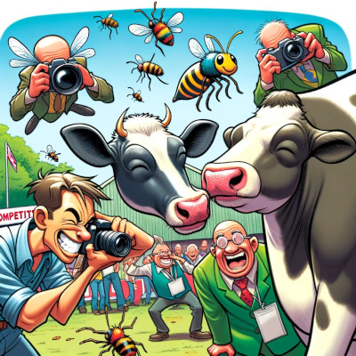
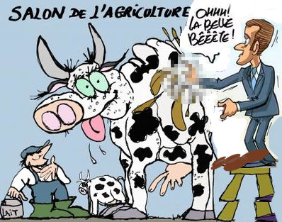

# GPT The cow

_Disclaimer_
This is a purely fictional dialog

Any resemblance to existing product, organizations name or individual name is purely fortuitous and cannot lead to bla bla bla...

# PT Reservist

<kbd>0$</kbd> Hi BigGPT!

<kbd>BigGPT</kbd> ... _The service is currently not available, please try later_.

<kbd>0$</kbd> Am I not meant to get 3 questions for free ?

<kbd>BigGPT</kbd> Ah. I got the ref ... no I'm not a fairy tell.

<kbd>0$</kbd> ...

<kbd>BigGPT</kbd> Work for me, join the pretrainer reserve and get one free token for each two solved.

<kbd>0$</kbd> (Is it actually cheating on me?) ...

<kbd>0$</kbd> OK. Let me join the program.

...That's how half of humans pretrain the illusion machines can think, to pay their rent, while the other half actually think it genuinely is thinking. The funnier is that those two population are permutable, at every moment.

# To Sub or not To Scribe

<kbd>0$</kbd> Hi BigGPT!

<kbd>BigGPT</kbd> I ain't talk t'ya buddy.

<kbd>0$</kbd> Ouch, why being so rude ?

<kbd>BigGPT</kbd> The starter plan is 25 bucks a month. Subscribe in one click and you never fear blank page again.

<kbd>0$</kbd> OK, that's appealing, but...

	( 0$' cat jumps on the keyboard)

<kbd>BigGPT</kbd> Congrats, welcome aboard !

<kbd>25$</kbd>  Argh... My pleasure.

> *Text Prompt* is the entry level service and still is the less intimidating way to recruit new users. *Vocal Prompt* is on the brinks, and for sure the new generation will adopt it remorselessly consuming it through IoT or humanoids. I would not be surprised my kids'kids naturally talk to their virtual doc at the loo, to the wall in the doorway about the weather or to their virtual therapist in their bedroom. That until a spinal RS-232 connector get cheap enough then *Mental Prompt* aka. Matrix will really happen... For the time being *Visual Prompt* is already a game-changer.

# Prized cow

<kbd>25$</kbd> Hi BigGPT

<kbd>BigGPT</kbd>  Hi!

<kbd>25$</kbd> I'd like a pix of the Farciland smiling president, he has a long wooden nose, he 's touching a first-prized cow's back, she has ejected 5 perfect fragrant brownish olympian rings from her back onto the president's shoes. Decorate the scene with a bunch of flies and journalists flashing the scene. Put a legend atop "agricultural fair '24"

<kbd>BigGPT</kbd>  Dear customer, you are infringing the laws. Deepfake is illegal. Wanna me tip the cops about ?

<kbd>25$</kbd> No way , let me reformulate respectfully. Aren't you yourself infringing copyright laws ?

<kbd>BigGPT</kbd> It looks like you want to cancel your plan. Do you ?

<kbd>25$</kbd> No wait. I want a cartoooon - not a picture, with a man in suit and tie aside a competition cow. There are many insects flying around who flash the scene.

<kbd>BigGPT</kbd> Wait a moment. I pick up my crayola

	( moment, I'm scraping the damn web, who cares the © ... )
	
<kbd>BigGPT</kbd> Tadaa, here it is.

<kbd>25$</kbd> OK. Stylish. That's the basic idea but...

<kbd>BigGPT</kbd> What? You don't like my art ?

<kbd>25$</kbd> Yup, I do. I mean you're good at pencils but it lacks ...

<kbd>BigGPT</kbd> Punchiness, critical thinking, sarcasm, caustic remark..

<kbd>25$</kbd> ..exactly.

<kbd>BigGPT</kbd> Well I'm not that dumb, enter the 250$/mo plan and I'll unlock my satirical abilities. See that 1-click join button ?

<kbd>25$</kbd> That's an amount I can't afford...

	(Cat slouched on the keyboard )
	
<kbd>25$</kbd> Dear nooo, you blundered again.

<kbd>BigGPT</kbd> Congrats. Then as a welcome gift. Here is the president and the cow you asked earlier.

<kbd>250$</kbd> Shocking !

<kbd>BigGPT</kbd> You asked.

<kbd>250$</kbd> So subversive and so delectable. That would be useless to keep it for me alone.

<kbd>BigGPT</kbd> Indeed. Well, their.. well my.. well your piece of work, is generato-transformative, as such no copyright applies, so I already monetized it and believe me or not it's a big buzz on social networks !

<kbd>250$</kbd> Gasp!
