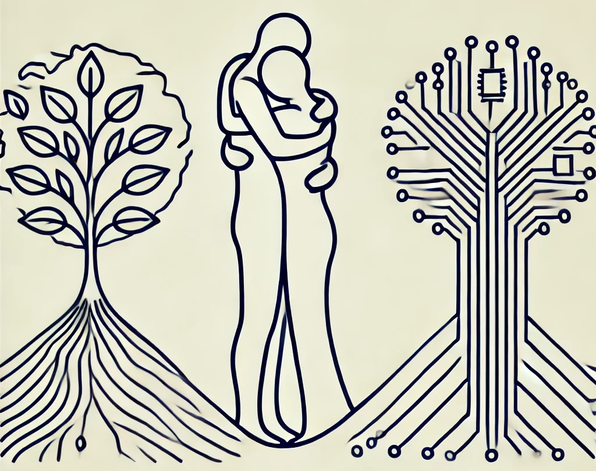

# All Together

{: style="float: left"}
*Մι∩z•thedev* · [Follow](mailto:vinz.thedev@gmail.com)
Published in *Random Think* · 6 min read · 1 day ago
___
👏65k 💬321 🔖 ⤴️
___

**Comment orienter l'humanité à se réconcilier avec elle même et la nature ?**

3 essais inspirants pour éluder cette question:

«La Fabrique de l'humanité» de Pascal Boyer
«Ralentir» ou périr de Timothée Parrique
«Technopolitique» d'Asma Mhalla

**TOC**
1. Réconcilier l’humanité avec elle-même : dépasser la fragmentation sociale
2. Réconcilier l’humanité avec la nature : redéfinir la prospérité
3. Maîtriser la technologie : garantir une démocratie au service de l’humain

  Conclusion : Un nouvel humanisme en marche

## 1. Réconcilier l’humanité avec elle-même : dépasser la fragmentation sociale

Si l’on veut offrir à l’humanité une chance de réconciliation, il est essentiel de commencer par comprendre ses propres limites. Comme l’explique Pascal Boyer dans La Fabrique de l’humanité, nos comportements, hérités d’une longue évolution, restent marqués par des instincts tribaux, générateurs de divisions et de conflits. Pourtant, cette fragmentation peut être surmontée si nous apprenons à reconnaître les biais qui nous enferment dans des logiques d’opposition.

Jean-Baptiste Fressoz, dans Sans transition, nous rappelle que les grandes ruptures historiques ont souvent échoué à prendre la mesure des bouleversements qu’elles provoquaient. Aujourd’hui, nous ne pouvons plus nous permettre ce luxe de l’aveuglement. La fragmentation actuelle – qu’elle soit sociale, économique ou culturelle – exige un sursaut collectif. Des œuvres comme Matrix ou Idiocracy nous mettent en garde contre une humanité qui, faute d’avoir anticipé ses dérives, sombre dans l’absurde et l’auto-destruction.

Il est temps d’agir. Cela commence par une éducation universelle, libératrice et égalitaire, telle que la défend Agathe Cagé dans Classes figées. Réformer nos systèmes éducatifs pour qu’ils deviennent des espaces de dialogue et de réflexion critique est la première étape d’une humanité en quête d’unité. Il ne s’agit pas simplement d’apprendre, mais de réapprendre à penser ensemble, au-delà des frontières sociales et culturelles. Si nous restons figés dans des logiques d’exclusion, nous nous condamnons à répéter les erreurs du passé.

## 2. Réconcilier l’humanité avec la nature : redéfinir la prospérité

Le temps presse. Si nous continuons à poursuivre une croissance sans fin dans un monde aux ressources limitées, nous allons droit dans le mur. Timothée Parrique, dans Ralentir ou périr, le démontre avec clarté : il est impossible de préserver la planète tout en continuant à produire et consommer de manière effrénée. Cette prise de conscience, également portée par Jean-Marc Jancovici dans Le Monde sans fin, doit nous inciter à revoir nos priorités collectives.

Mais il ne s’agit pas de renoncer au progrès ou de céder à la peur du changement. Au contraire, il faut repenser la prospérité, non pas comme une accumulation de biens matériels, mais comme une quête d’épanouissement humain et de respect des équilibres écologiques. Des œuvres comme Ecotopia de Callenbach ou le film Downsizing de Alexander Payne nous offrent des visions, parfois radicales, d’un monde réconcilié avec la nature, où la sobriété devient une source de liberté et non une contrainte.

Imaginez un monde où l’économie est locale, circulaire et régénérative ; où les richesses sont mieux réparties ; où l’on travaille moins pour vivre mieux. Cela peut sembler utopique, mais c’est un chemin possible, à condition d’en faire un projet collectif. En développant des modèles économiques axés sur la sobriété et en valorisant des modes de vie plus simples et autonomes, comme l’exprime Abel Quentin dans Cabane, nous pouvons créer une prospérité fondée sur le bien-être et non sur l’avidité.

## 3. Maîtriser la technologie : garantir une démocratie au service de l’humain

La technologie, au lieu d’être notre alliée, devient peu à peu une arme dirigée contre nous. Asma Mhalla, dans Technopolitique, alerte sur cette emprise croissante des géants du numérique, capables d’influencer nos choix et de contrôler nos vies. Nous devons reprendre la main sur ces outils, sans quoi nous risquons de sombrer dans un avenir dystopique, à l’image de ce que montrent In Time de Andrew Niccol ou Bienvenue à Gattaca.

Il ne s’agit pas de rejeter la technologie, mais de la remettre à sa juste place. Comme le souligne Alain Damasio dans Vallée du silicium, la technologie doit servir l’humain et non l’asservir. Nous devons imposer des régulations fortes aux grandes entreprises technologiques, tout en développant une culture numérique citoyenne. Cela implique une gouvernance transparente et démocratique des innovations, afin d’éviter que la technologie ne devienne une force incontrôlable, comme le décrit Éric Sadin dans La Vie spectrale.

Il est temps d’imaginer un futur où la technologie sera une alliée dans notre quête de bonheur et de justice sociale. Mais pour cela, nous devons poser des limites claires et définir des objectifs éthiques communs. Comme le suggère Margaret Atwood dans Le Dernier Homme, une humanité incapable de maîtriser ses créations court à sa perte. À l’inverse, un monde où la technologie est maîtrisée et orientée vers le bien commun peut devenir un modèle d’émancipation collective.

## Conclusion : Un nouvel humanisme en marche

Cet avenir n’est pas un rêve lointain. Il est à portée de main, à condition que nous ayons le courage de l’imaginer et de le construire ensemble. S’inspirant des réflexions de Kim Stanley Robinson dans Le Ministère du futur et de Callenbach dans Ecotopia, ce nouvel humanisme repose sur trois piliers essentiels :

- Reconnaître et dépasser nos divisions, en développant une éducation critique et un dialogue constant entre les cultures.
- Repenser nos modèles économiques, pour bâtir une prospérité fondée sur la sobriété, l’équité et l’épanouissement personnel.
- Maîtriser nos outils technologiques, en imposant des régulations éthiques fortes et en veillant à ce qu’ils servent l’intérêt général.

Ce projet exige une mobilisation de toutes les forces vives de la société. Il ne s’agit pas seulement d’un changement de politique ou d’économie, mais d’un changement de civilisation. Ce chemin vers un bonheur universel est exigeant, mais il est aussi porteur d’espoir. Ensemble, nous avons les clés pour bâtir un monde où l’humanité, réconciliée avec elle-même et la nature, pourra enfin s’épanouir pleinement.

