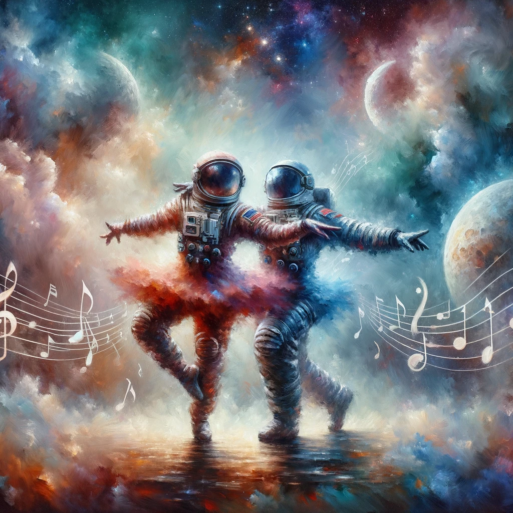
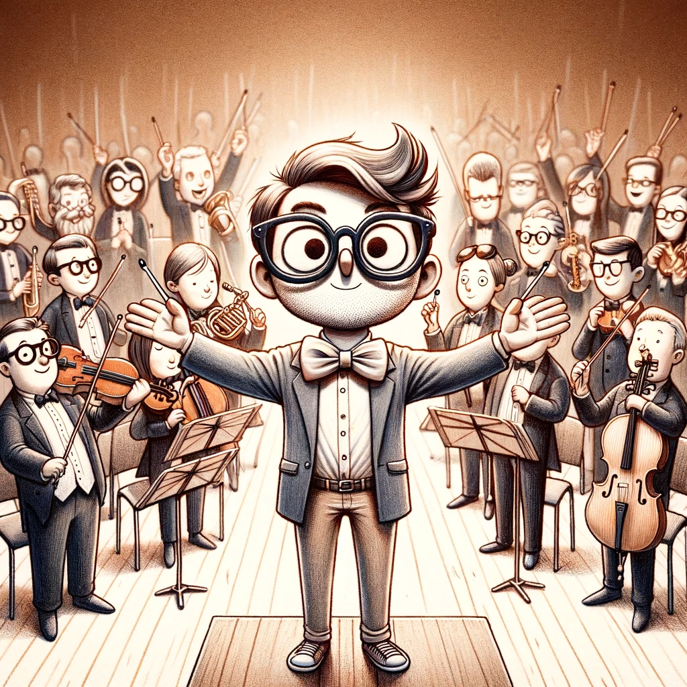
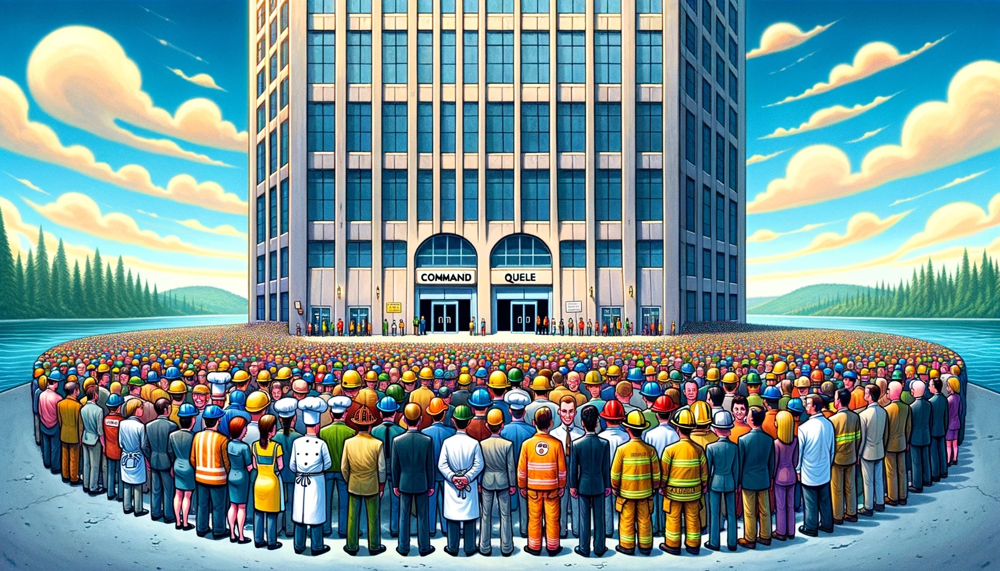
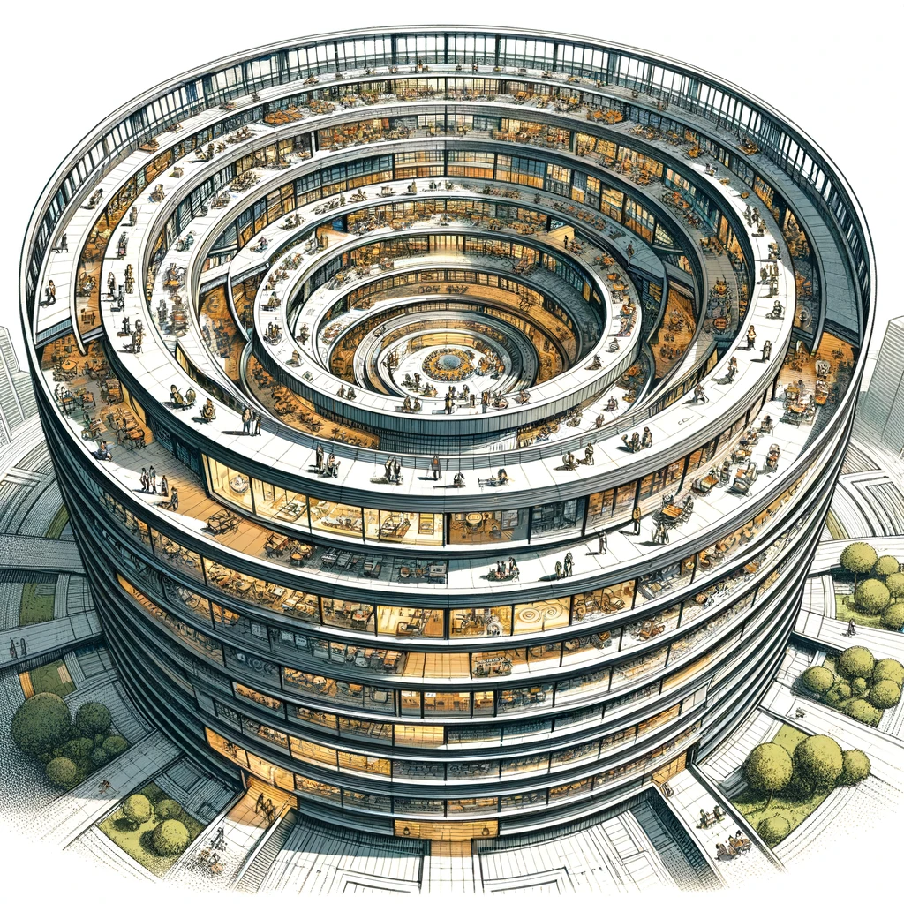
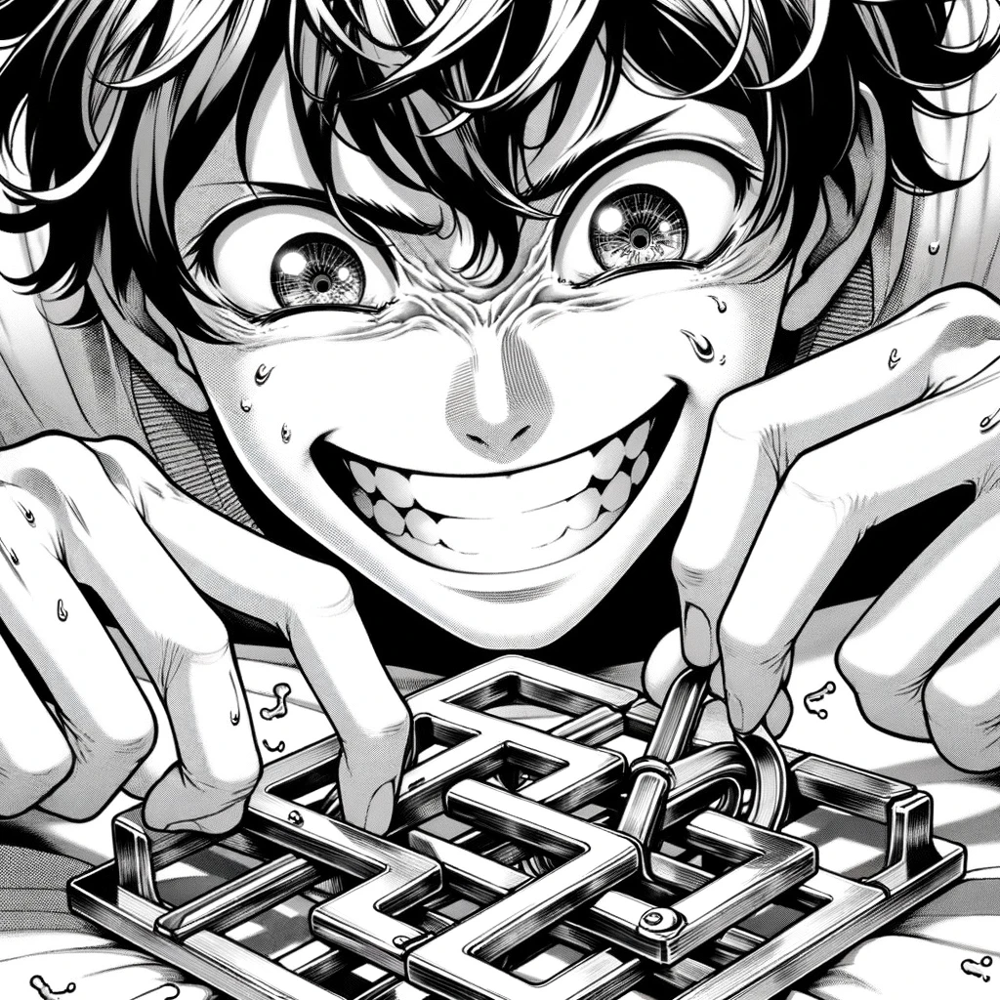
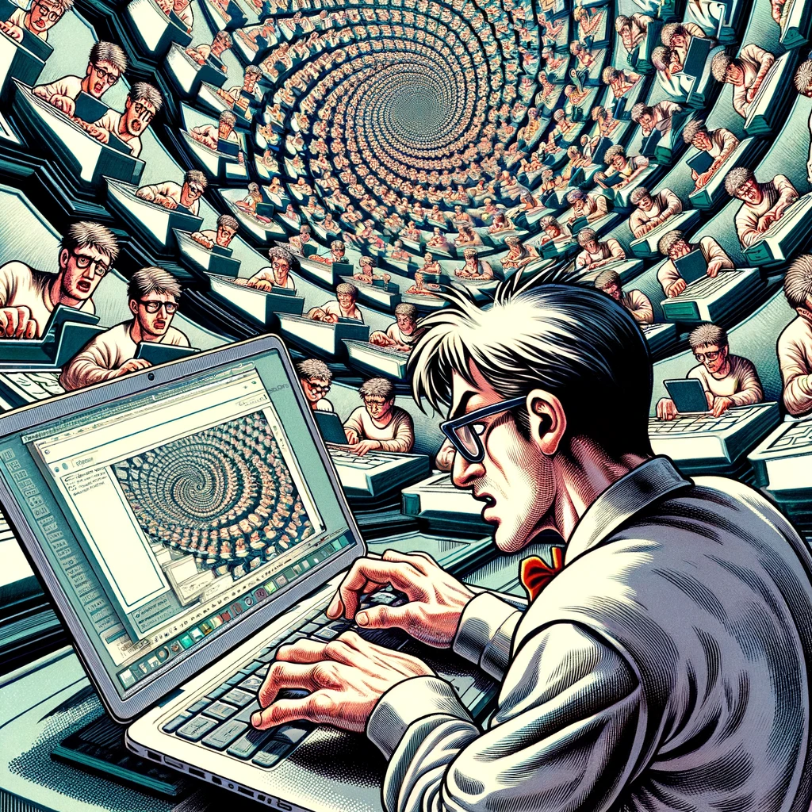
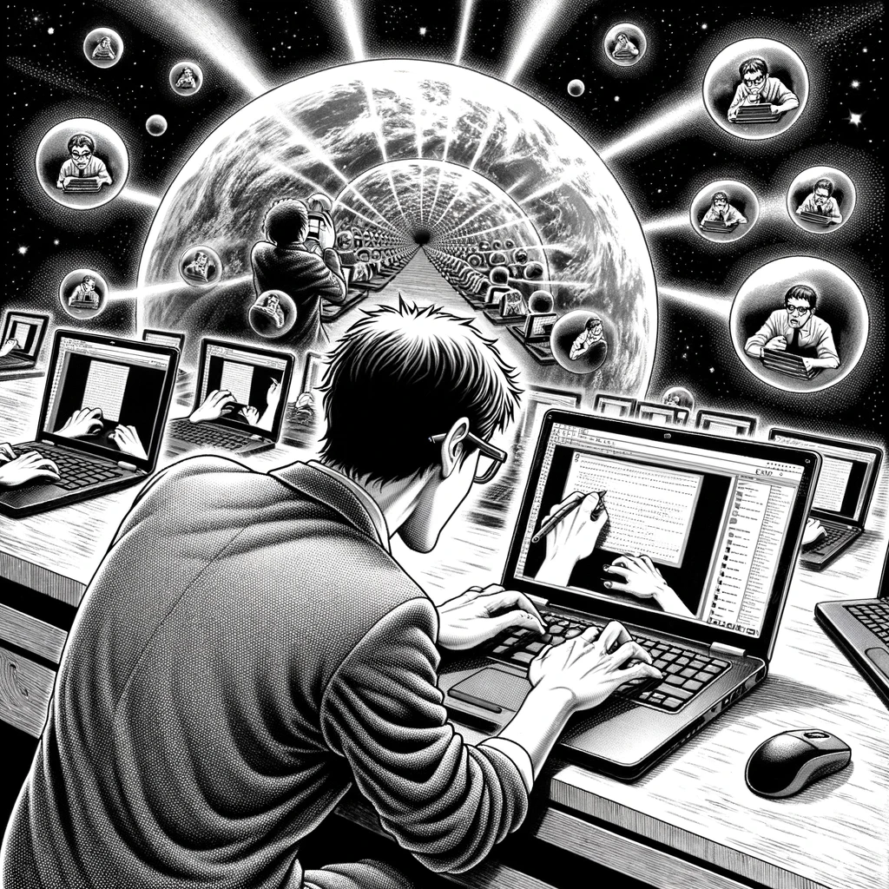
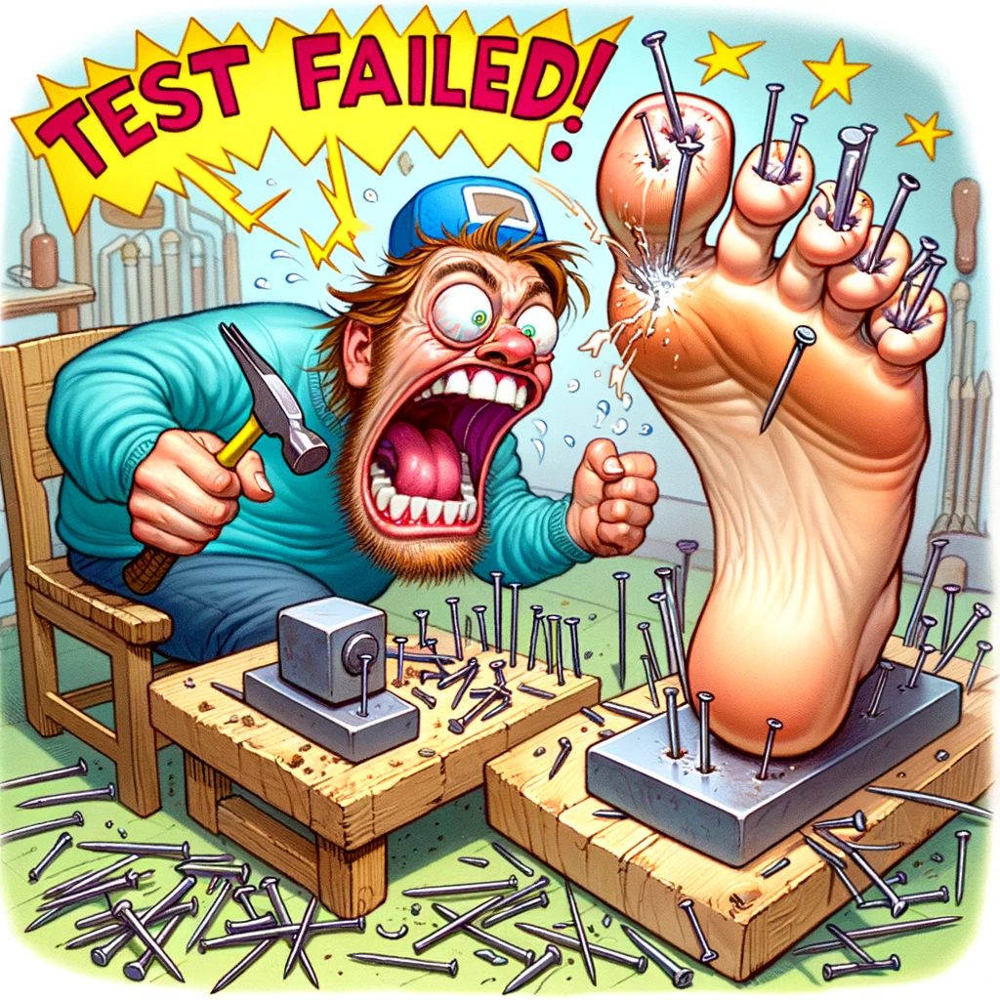
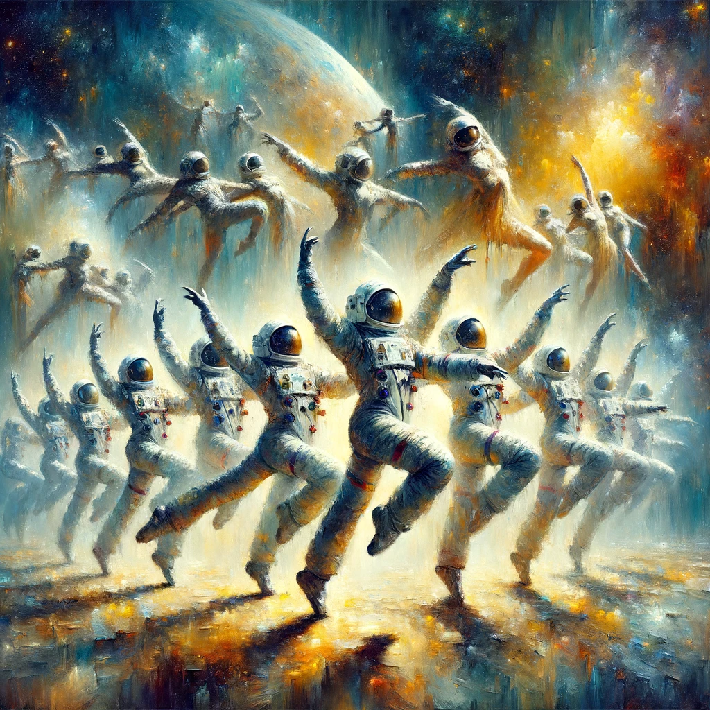
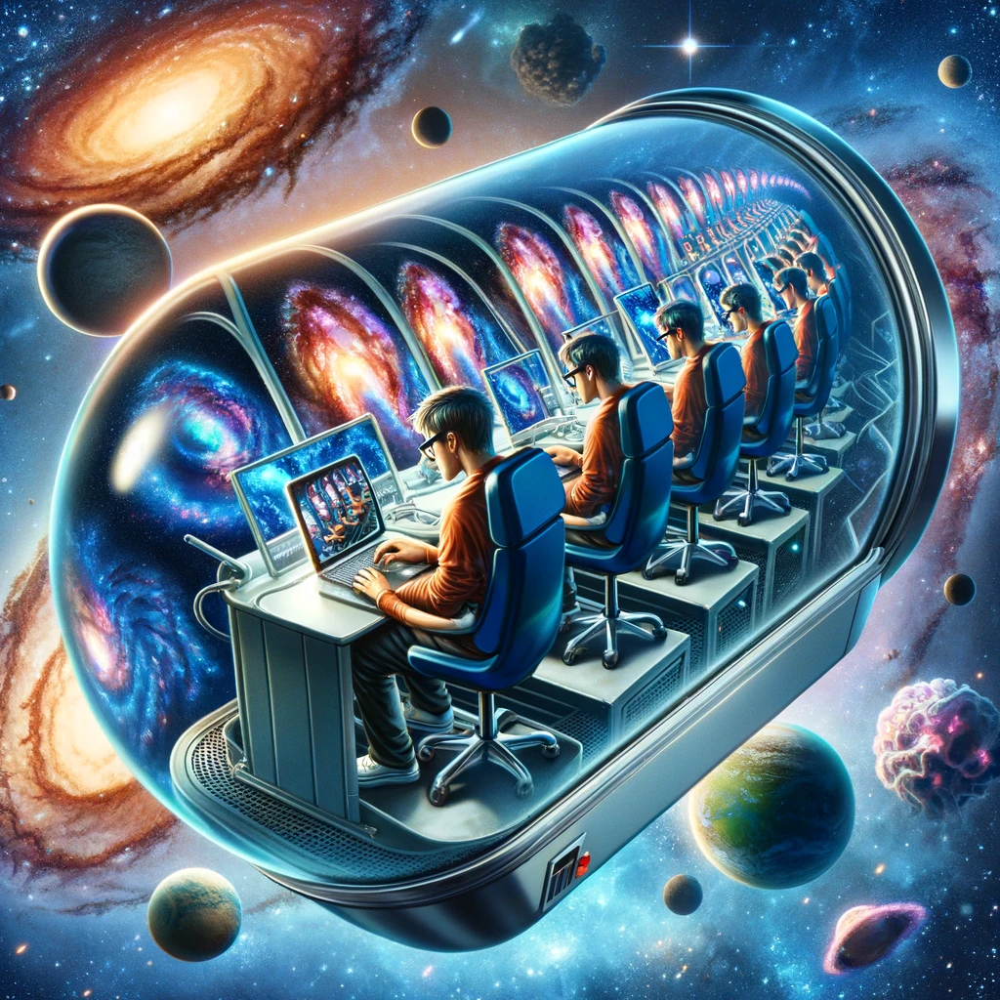

# DDD Ballet

{: style="float: left"}
*Մι∩z•thedev* · [Follow](mailto:vinz.thedev@gmail.com)
Published in *Random Think* · 6 min read · 1 day ago
___
65k 321  猡达
___

## Preface

In the realm of creation, where the meticulousness of a well-designed software microservices architecture intersects with the harmony of a finely conducted music orchestra, one can't help but ponder the philosophical parallels between these two forms of artistry. How do the discrete yet cohesive services in a microservices architecture mirror the distinct sections of an orchestra, each contributing their unique sounds to create a symphonic masterpiece? Does the role of the conductor find its echo in the orchestrator of services, guiding them to perform in unison towards a common objective? These questions invite us to explore the symphony of structures and patterns, where technology and music intertwine, revealing the universal principles of harmony, collaboration, and design that underlie both worlds.
## Software architecture, Orchestra conducting, same battle ?

In the grand orchestra of software architecture and design patterns, each component plays a vital role in the harmonious delivery of a scalable, robust, and maintainable system. Like a well-conducted orchestra, where musicians, instruments, conductors, and the audience interact in a complex yet beautiful harmony, software design elements work in concert to create systems that are both elegant and efficient. Let us embark on a philosophical journey through the realms of software design, comparing each concept to the components of an orchestral performance, revealing the intricate symphony of code and architecture.

### Command Query Responsibility Segregation

CQRS can be likened to the relationship between the conductor and the musicians. Just as a conductor directs the orchestra to produce music (queries) and listens to their output to make adjustments (command), CQRS separates read operations from write operations, ensuring that the system’s performance is optimized and its design is clear, much like the conductor's gestures guide the orchestra's performance.

### Onion Architecture

Onion Architecture resembles the concentric layers of an orchestra, with different sections (strings, woodwinds, brass, percussion) surrounding the conductor at the center. Each layer has a specific role, contributing to the overall sound. Similarly, Onion Architecture organizes software into layers, with the core domain at the center surrounded by application and infrastructure layers, facilitating a cohesive yet decoupled system design.

### Layers

Core Business Layer and Technical Layer can be compared to the soloists and the accompaniment in an orchestra. The core business layer, like the soloists, carries the melody—the essential business logic—while the technical layer, like the accompaniment, supports the business layer with necessary infrastructure, data access, and utility functions, enhancing the overall performance without overshadowing the main theme.

### Functional

Radial Functional Slice in software design is akin to the sections of an orchestra. Just as each section (strings, woodwinds, etc.) focuses on a specific range and timbre, contributing to the overall piece, radial functional slices encapsulate related functionalities (e.g., user management, order processing) within a system, allowing for focused development and maintenance.

### Domain-Driven Design

DDD and its components such as Domain Ubiquitous Language, Entities and Services, and Event Notification can be compared to the entire orchestration process. DDD emphasizes deep understanding and modeling of the business domain, much like a composer and conductor must understand the music piece and the orchestra. Ubiquitous language ensures everyone—developers and domain experts alike—speaks the same language, similar to how a musical score provides a universal language for musicians. Entities and services within DDD are like the musicians and their instruments, each with a specific role and way of interacting, while event notification mirrors the cues and signals musicians and conductors use to synchronize their performance.

### Pub/Sub

Publish-Subscribe Bus and Async Complex Operations reflect the dynamic interaction between the audience's reactions (applause, silence) and the orchestra's performance. Just as an audience's feedback can influence the flow and energy of a concert, publish-subscribe mechanisms and asynchronous operations allow for flexible, decoupled communication and task execution within a system, adapting to varying loads and conditions.

### Finite State Machine

FSM Orchestrator allows Remote Actors Cooperation. Fail, retry, and recovery policies are akin to a conductor managing a performance with guest soloists from different countries. The FSM orchestrator, like the conductor, oversees the transitions and states of the system, ensuring coherence and response to events, while remote actors cooperation ensures that even in the face of challenges (e.g., a soloist's mistake), the performance can continue smoothly through well-defined recovery mechanisms.

### Semantics

Data Semantical Translation through domains and layers mirrors the translation of a musical piece's emotion and message across different cultures and languages, ensuring the essence remains intact regardless of the audience. Similarly, semantic translation ensures that data maintains its meaning and relevance as it moves through different layers and domains of a software system.

### Micro-services

DDD naturally shapes Microservice Architecture. Domain to Own Its Data resembles the principle of each musician being responsible for their part but contributing to the collective performance. Microservices, guided by DDD, is like independent musicians who manage their scores (data) but play in harmony to deliver a unified piece.

### Databases

SQL Database, ORM, Repository can be likened to the music library and the librarian managing scores for the musicians. Just as the librarian ensures that scores are accessible, organized, and in good condition, the ORM repository manages the storage, retrieval, and manipulation of data, acting as an intermediary between the domain and the database.

### Logical split, distribution split

Complex Software Build Architecture are much more comprehensible with Solution, Solution Folders, Projects, Contracts. Quality is enforced by using Unit Tests, Integration Tests, End-to-end Tests. That's like the meticulous preparation for a grand orchestral performance. Every piece, from the selection of the repertoire (solutions and projects) to rehearsals (testing phases), is crucial for the flawless execution of the concert, ensuring that each note resonates with the intended clarity and emotion.

### Testing

Seeding Data Landscape, creating Live Environment Modeling allows Stress, Speed, and Performance Tests. We can parallel that to the final rehearsals and tuning before a performance, where every aspect from the acoustics of the hall to the responsiveness of the musicians under different scenarios is tested and adjusted. This preparation ensures that when the curtain rises, the orchestra performs at its best, captivating the audience with a flawless rendition.

## Conclusion

In this philosophical exploration, we see that the symphony of software architecture and design patterns is as complex and nuanced as a grand orchestral performance. Each component, from CQRS to microservices, plays a critical role in the system's overall harmony, efficiency, and resilience. Just as an orchestra's beauty lies in the coordinated effort of its many parts, the strength of a software system lies in the thoughtful integration and interaction of its many design elements, guided by the philosophical principles of clarity, cohesion, and flexibility.

### Opening

As we traverse the cosmic dance of creation and destruction, from the voracious appetite of black holes to the explosive genesis of the Big Bang, we witness a parallel in the relentless drive of capitalism shaping software evolution. This cosmic ballet, with its cycles of destruction and rebirth, echoes the tumultuous yet creative forces of market dynamics. In the grand tapestry of the cosmos, from the rhythmic dance of planets to the majestic turmoil of galactic collisions, we find patterns of stability that mirror the iterative processes in software development. Could it be that the universe itself, in its infinite complexity and order, is akin to a grand, self-evolving software simulation? Are we, as observers and creators, participating in a singular, universal code?
