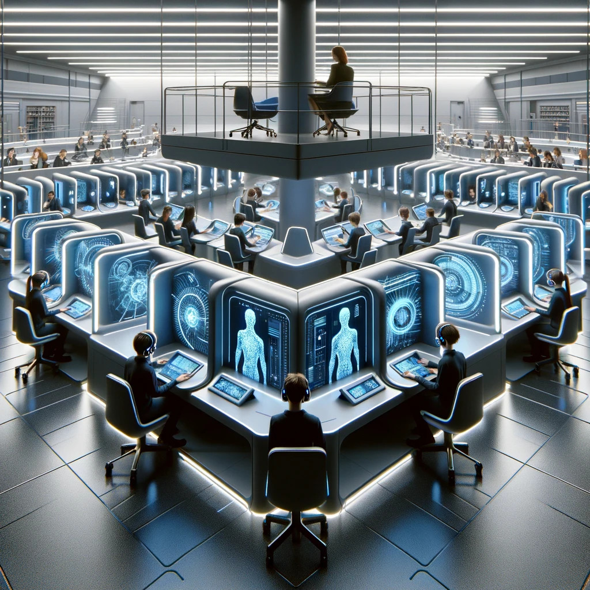
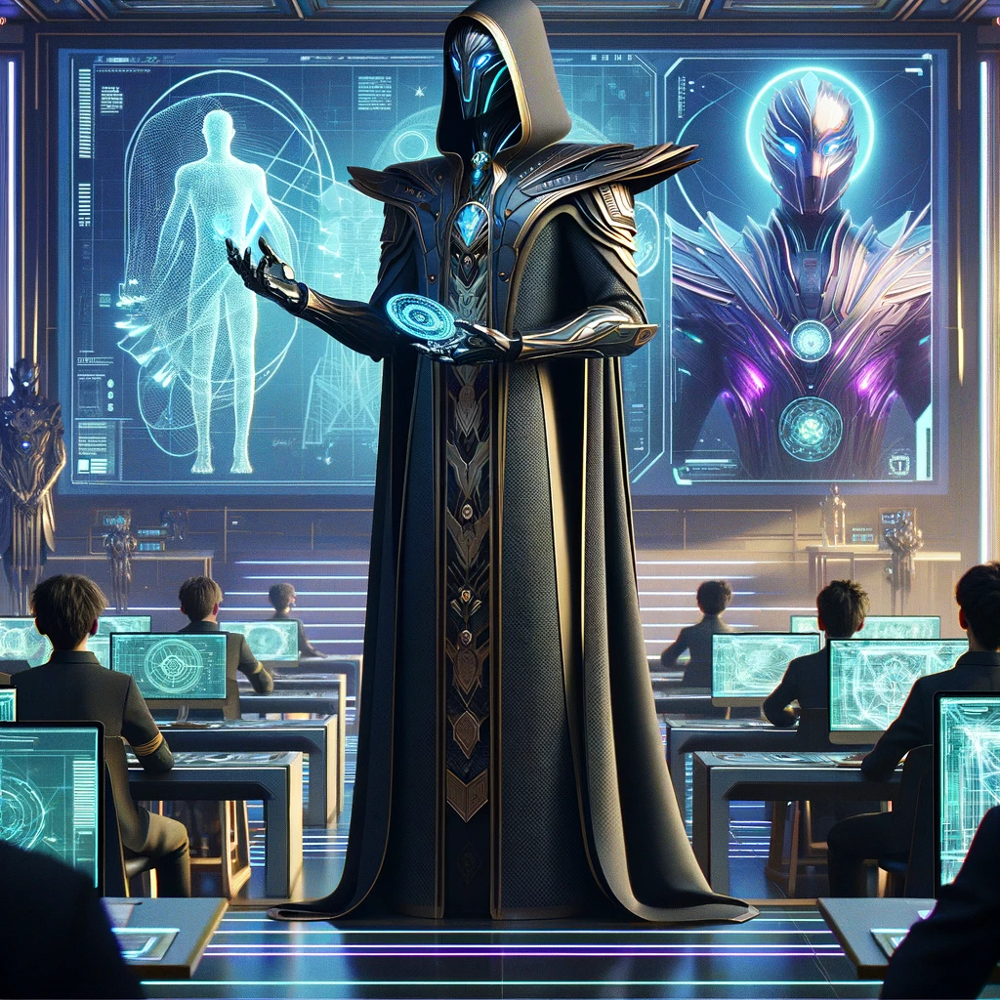
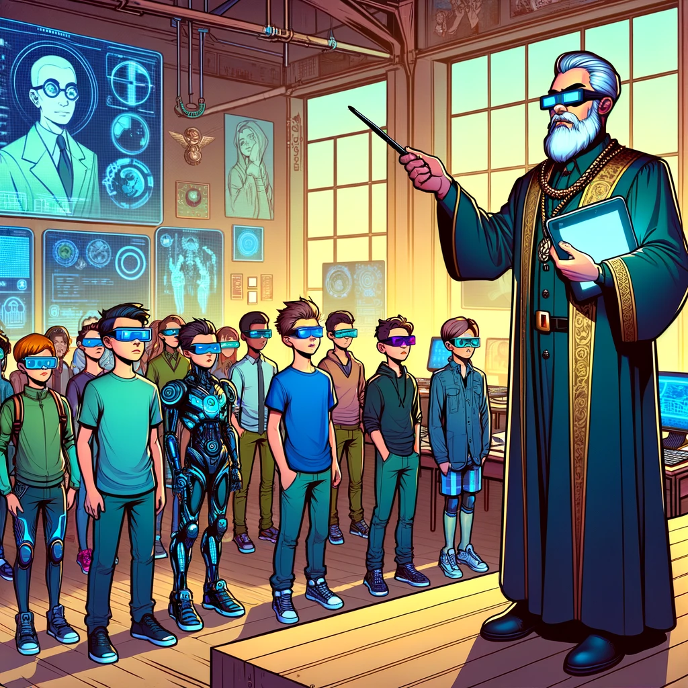

# The Future of Education

{: style="float: left"}
*Մι∩z•thedev* · [Follow](mailto:vinz.thedev@gmail.com)
Published in *Random Think* · 6 min read · 1 day ago
___
👏65k 💬321 🔖 ⤴️
___

_Disclaimer 1:_
still under development think

_Disclaimer 2:_
I like writing dystopia because nowadays epoch is like a roller coaster, so there's a slight chance if I thought of 10 possibilities during the night, in the morning 1 really happens, that's the thrill about it.

When traditional classrooms, schools and teachers will gradually be abandoned, is IA only, be left and responsible for educating young humans ? Who will govern the knowledge promotion policy ? How can nations continue to produce citizens ? Is the universal nature of networks and IA going to produce the ultimate totalitarian system mankind would have ever had ? Is delegating worldwide governance to an IA an appropriate tradeoff to stop stupid wars and environment spoiling ? If the IA is programmed with a bias, who is taking profit of it, in other words, who is the true world leader ? Is it the last decade we can make joke ?

_Episode 1_
*How IA sees education soon.*

Observe body segregation and self and supervised teaching, maybe first retaining dedicated places to gather but then home education will save a lot of money and avoid unmonitored relationships and troubles. Supervisors will gradually monitor more and more students hence fewer will remain and be a powerful caste. 

_Episode 2_
*The turn point*

Augmented with IA technology, humans will think differently, gain undreamt-of new abilities, like crushing large amount of data and put up visuals in seconds, laser-synthetizing interminable speech in no time, arrange personal or large teams timetables the most cleverly, amongst many others. 

Asking if it's good or bad is the wrong question. The cloud period has come boldly. As Humanity collective intelligence is making a leap forward, human individual spirit will adjust, while our body still remain as is. It's too short an extent on the evolution scale, to pretend we will develop longer fingers, bigger eyes, more active brain, telepathic skills.
However destiny of many humans is to undergo the ruling of the techno leaders.

IA will give workers a productive advantage to crush competitors. Hence unconverted workers will quickly comply to the new norm to come. Given a small impetus to use these technology like a one month free plan, individuals and companies will soon reach a no-return point of total dependence.

Maybe it will increase the collective sense of urgency to manage very efficiently the resources, having deep new insights. And because technology is not self replicating like life is, on the top some form of life can sleep for centuries before restart, and because current technology needs enormous amounts of resources, that will necessarily prompt for peace and order.

We are 21th century's neandertal. At best a fraction of our humanity will remain in the next humanity, like we have actually 1 to 4% of this ancient lineage ADN in our.
The risk is that the augmented technologization collapse all at a sudden because of resource shortage, greed and war.

So how best shall we ask the IA we shape today to educate our children, refering Asimov robotics laws ? Even for today only seem-clever IA, how best should we tune the algorithm to promote a bright future ? Has Aldous Huxley's Brave new world finally come. Now it's time to design our tomorrow humanity ? I think it's time for UNO to open a new section to engage the dialog and mediate these questions, as urgently as peace and climate are concerning.

_SF Movies_

Here are my favorite fictions figuring techno-humans : Jodorowsky's Metabaron, Twohy's Riddick ex-necromonger. It looks like technology and war are one. I witness it's true, in history, military buildup and science leap are concomitant.

I like these movies asking about the barrier between the human and the machine, Alien (Covenant SVP) and the mysterious android called David, the Terminators of course (Last Judgment's T-800 is so cool), the replicant K in Blade Runner (Villeneuve's so beautiful), Matrix (perso I like Resurrection) Are Neo and Trinity a simulation in the end ? Last year Edward's The Creator is very welcome as well. I have also good souvenir of Chappie, Her,  IRobot, RealSteel, WallE. How many times did I watch WallE with my kids ?