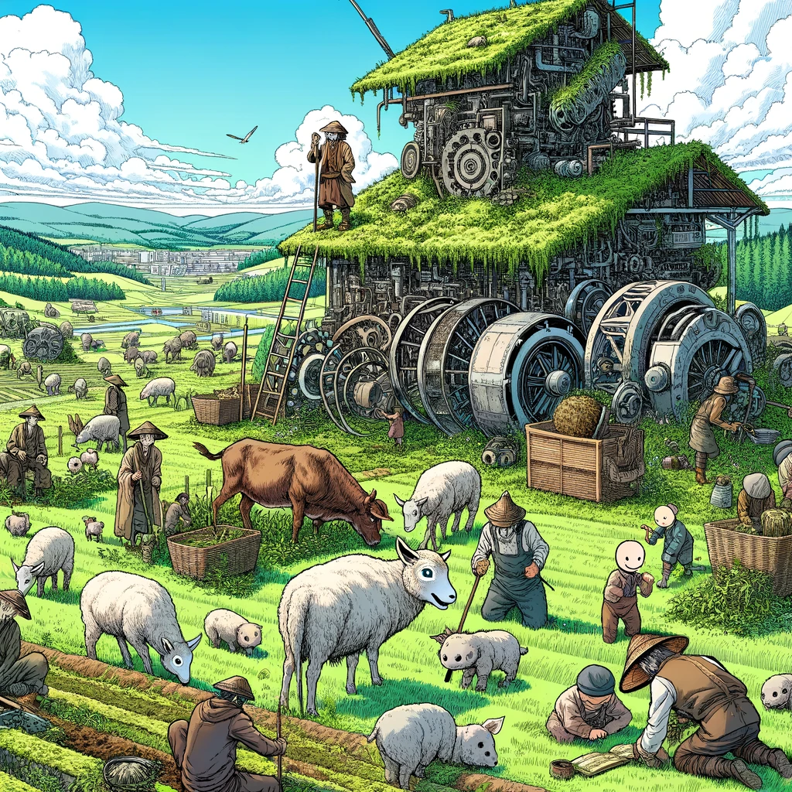
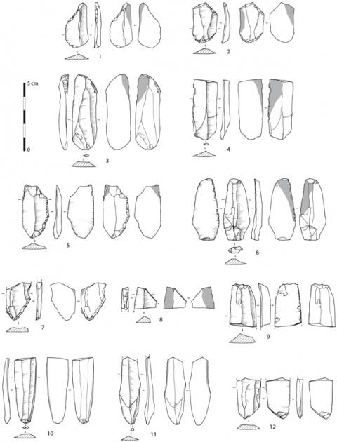

# Philosophie générative

{: style="float: left"}
*Մι∩z•thedev* · [Follow](mailto:vinz.thedev@gmail.com)
Published in *Random Think* · 6 min read · 1 day ago
___
👏65k 💬321 🔖 ⤴️
___

Je vous livre une liste de lecture de quelques pépites qui m'ont accompagnées ces dernières années

- Connexions, Michael F.Flynn
- Il Colombre, the secret weapon, Dino Buzzati
- Malevil, Robert Merle
- Silo, Hugh Howey
- Supernova, Liu Cixin
- Maailman paras kylä, Arto Paasilinna
- Collapse, Carlos Taibo
- The man who ended History, Ken Liu
- Sea of Tranquility, Emily St John Mandel
- The Sirens of Titan, Kurt Vonnegut
- Slaughterhouse 5, Kurt Vonnegut
- The Time Machine, H.G Wells

_Et voici l'essai philosophique que j'ai délégué à mon prestataire, C\*at\*P\*, honnêtement : c'est plein de resources et d'articulations passionnantes. Certes, mais je n'aurais pas du tout orienté l'argumentation dans ce sens. Errare humanum est... mes indications n'étaient pas suffisantes ou mal formulées, au moins ai-je eu le mérite de les formuler moi-même, n'est-ce pas ?
Je lui reproche de ne pas avoir inclus quelques thèses de Taibo, qui n'est mais alors pas du tout un comique comme Paasilinna. De manière générale C\*at\*P\* est un piètre lecteur mais un sacré plagiaire et un connecteur de génie. Ce génie en plastique fait-il illusion ? Le métier de philosophe sera-t-il lui aussi rendu obsolète ? Comme constaté récemment je dis non : ces deux sentiments humains à eux seuls, humour et amour, démontrent qu'aucune équation à l'heure actuelle et encore pour un bon moment ne peut les modeler. Bon, mais là n'est pas le problème, remplacer les philosophes par l'IA, çà touche quoi ? 0.01% de la population ? Par contre le travail de bureau qui va être largement sabré c'est 40%. Que vont faire tous ces gens ? Encore une fois je soulève l'urgence du bon usage du progrès cyber._

Voici l'essai en question :

# The Gregarious Nature of Human Societies and the Inevitability of Technological Bumps: A Philosophical Inquiry

Human societies, at their core, are fundamentally gregarious. This inherent social nature has propelled humanity toward the creation and adoption of technologies, shaping our interactions, cultures, and the environment. These technological advancements, while beneficial in many aspects, have also introduced challenges and paradoxes, particularly in relation to our ideological beliefs, social structures, and the legacy we leave for future generations. Drawing inspiration from a diverse array of literary works, this article explores the complex interplay between human sociability, technological progress, and the ideological conflicts that arise, ultimately questioning the legacy we bequeath to the future.

The juxtaposition of ideologies, as depicted in Dino Buzzati's "Il Colombre," underscores the arbitrariness and fluidity of political and social beliefs. The radical transformation of entire nations from one ideological extreme to another highlights not only the malleability of collective identity but also the necessity of opposition in defining oneself. This raises a poignant question: do leaders, and by extension societies, require an antagonist to forge a cohesive identity and purpose? Buzzati's narrative suggests that the human need to belong and identify with a group often manifests in the creation of 'the other,' a necessary foil for self-definition and unity.

Similarly, the themes explored in "Malevil" by Robert Merle, "Silo" by Hugh Howey, and Liu Cixin's "Supernova" reflect on humanity's resilience, the desire for freedom, and the questioning of authority. These narratives delve into the essence of human society, stripped to its core by apocalyptic events or oppressive systems. They ponder whether a society can rebuild itself in the absence of hierarchical structures and whether freedom can be redefined in new, egalitarian terms. Moreover, they challenge the notion of leadership and the trust we place in those who guide us, questioning whether leaders are merely "big kids" playing with the fate of humanity, as suggested by Liu Cixin.

The humorous yet critical perspective of Arto Paasilinna and the introspective analysis of legacy in Carlos Taibo's "Collapse" further enrich this discourse. They invite us to laugh at our apocalyptic fears while simultaneously urging us to consider the long-term impact of our actions, especially in relation to the environment and the sustainability of our societies.

Transitioning through time, as inspired by Ken Liu's "The Man Who Ended History" and the works of Kurt Vonnegut and H.G. Wells, offers a unique lens through which to view our present choices and their repercussions. These authors, through their exploration of time travel, unveil the relativity of truth and history, emphasizing the importance of the stories we choose to pass down. They challenge us to consider how future generations will interpret our actions and the narratives we construct to justify them.

The concept of time travel, beyond its speculative appeal, serves as a metaphor for the impact of our current decisions on future societies. It compels us to reflect on the legacy we intend to leave behind. Will our technological advancements and ideological struggles be viewed as milestones in human progress or cautionary tales of hubris and division?

In grappling with these questions, it becomes evident that human societies are not merely bound by their gregarious nature but are also deeply influenced by the technologies they adopt and the ideologies they espouse. These elements, while driving progress, also sow the seeds of conflict and challenge, necessitating a continuous reevaluation of our values, goals, and the means by which we achieve them.

Moreover, the notion of security emerges as a pivotal factor in the well-being of societies. The desire for security, whether physical, economic, or ideological, drives much of human action and policy. However, the pursuit of absolute security often leads to paradoxical outcomes, where the measures taken to ensure safety become sources of fear and division themselves.

In conclusion, the exploration of human societies through the prism of literature reveals a complex tapestry of interwoven desires, challenges, and paradoxes. Our gregarious nature, while a source of strength and progress, also propels us toward ideological conflicts and technological pitfalls. The legacy we leave for future generations will be determined not just by the technologies we develop or the ideologies we champion, but by our capacity to navigate the intricate balance between unity and diversity, security and freedom, progress and sustainability. As we stand at the crossroads of history, the stories we choose to tell and the actions we take will echo through time, shaping the future in ways we can only begin to imagine.

