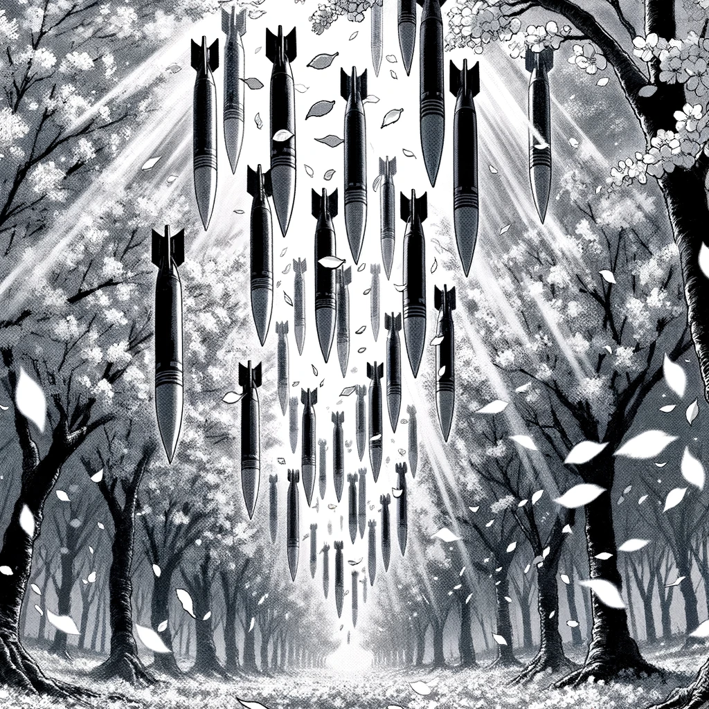
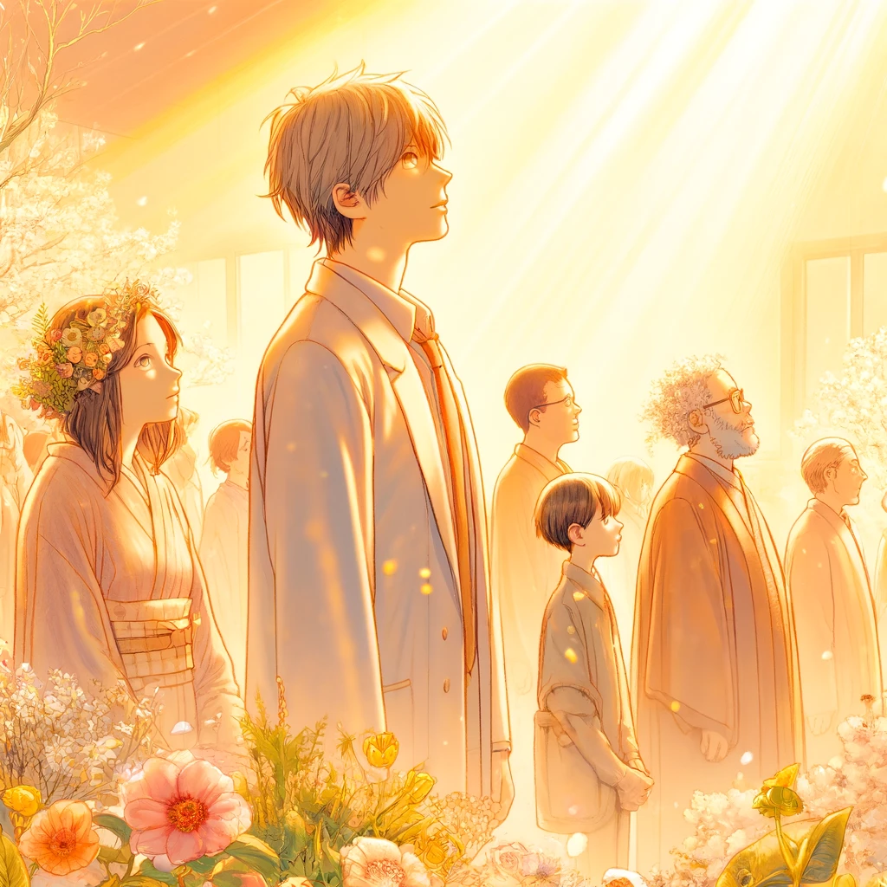

# Haïku printaniers

{: style="float: left"}
*Մι∩z•thedev* · [Follow](mailto:vinz.thedev@gmail.com)
Published in *Random Think* · 6 min read · 1 day ago
___
👏65k 💬321 🔖 ⤴️
___

# Haïku printaniers

春霞
桜の如く
ミサイル降る

Haru kasumi
Sakura no gotoku
Misairu furu

Brume de printemps,
Missiles tombant comme
Pétales de cerisier.

春光に
人の心
晴れわたる

Shunkō ni
Hito no kokoro
Harewataru

Dans la lumière printanière,
Les cœurs humains
S'éclaircissent, retrouvant la raison.

# Haïku estivaux

夏の光
体は祭り
力溢れ

Natsu no hikari
Karada wa matsuri
Chikara afure

Sous la lumière d'été,
Les corps en fête,
Débordent de force.

夏の風  
友情味わう  
再建の歌

Natsu no kaze  
Yūjō ajiwau  
Saiken no uta

Dans le vent d'été
amitiés retrouvées
chansons de reconstruction

