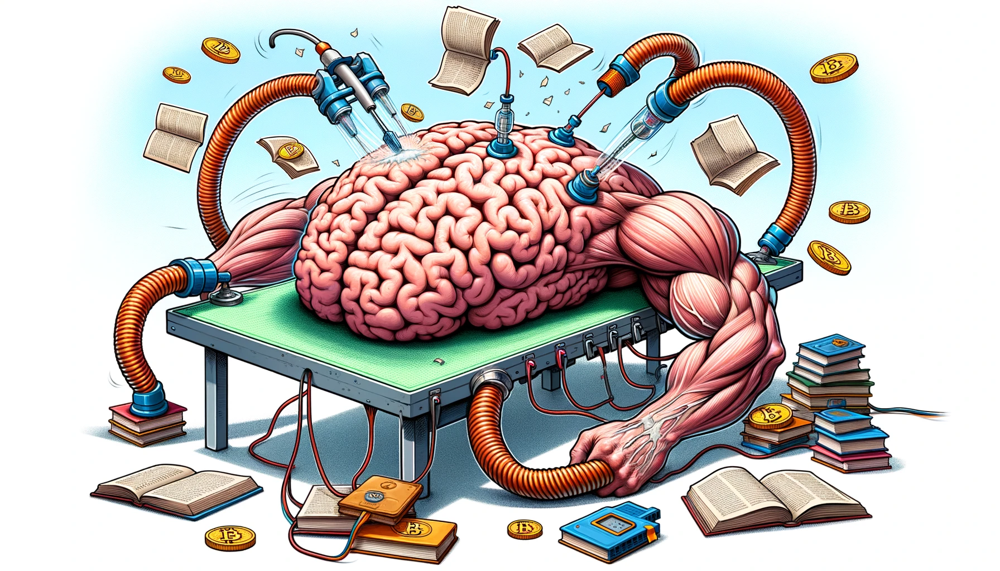

# Intelligent brain f＊＊＊ing

{: style="float: left"}
*Մι∩z•thedev* · [Follow](mailto:vinz.thedev@gmail.com)
Published in *Random Think* · 6 min read · 1 day ago
___
👏65k 💬321 🔖 ⤴️
___

- Collaborative knowledge such as Wikipedia will disappear.
- Physically teaching jobs will disappear.

## Knowledge masters

Only a handful of super-state global companies will own the knowledge and organize how to produce, broadcast, being tithed by every human being for free from age 3 when the toddler can start touch-screening.

_Opt-in or stay on the verge._

Terrestrial TV, Cinema is going to end with the current generation, youngster already do watch only TheirTube. They get brain washed and profiled thoroughly but happier than ever.

## Economic model

Laws care to preserve property of a handful and stimulate innovation for new profits, but don't give a shit for preserving well-balanced young-to-become minds. We need not only to keep the fire being vigorous but we need also to select carefully what we burn cause who wants to get burned out for somebody who does not care for you and your relative, and what about a totally psychotic society to arise is that a 2.0 model to follow ?

## Books vs Game

I came to think books, aka slow culture, was some form of mind healing and renewal. Many amongst youngsters despise the richness gathered by their elders, as close as in their own homes, or in the public libraries. Paper is _has-been_ they say. Fine ! Then find and read on your screens what you like, whatever makes you expand your inner intimate borders beyond your current condition. They grasp their terminal and find an entertaining game for... hours... Am I an ol'grump saying that ?

## Connection

I was a zealous video game player as well in my teen years and I also read books that made me feel the urgent need to travel and meet. To the youngsters I'd say, alternate fun, introspection, research, quick and slow culture, learn effort can taste good, never give up, be curious, no shy, ask, share, imagine. I cherrish my 20's for the freedom it gave me and the maybe simple-minded and idealistic mindset I had but that gave me a lot of strength. Now I'm like an antique lustered door that has been repainted many times. I am the now-me, I am the 20 years old boy I was as well. I am the child, the father, the husband, the many places worker and dweller, I am the books I read, I am movie I saw, the music I listened. I am the nice people I met. Each stop does superimpose on the previous, they don't melt together but where there are scratchs, souvenirs do surface up and that's a profound sentiment to feel we are all part of a big chain, connected together throughout time and space. Humanity did not wait for Wifi and Internet to get connected together. So do human and other species, so does our sun and the universe. As a technology, how appealing may it be, never forget who you are, where do you come from and where do you want to go, and use it mindfully.

## Urgency to tame the beast

Does freedom means the choice to choose one's own slavery ? Is everybody the master of another ? Does virtuality, fake and mass personalized broadcast mean implicit opt-in for global free will abdication ? Which side of the table do you want to sit ? Even if being skillful and enlightened with humanitarian views, what fraction would dare curve the wild beast trajectory for an harmonious future of mankind on earth.

## Ads

Au début Internet c'était un truc d'universitaire, un truc utopique en sorte, qui fonctionnait avec une misère de bande passante, du pure contenu sans contrepartie. Le rêve absolu. (_rev. bon ok c'était un truc militaire au tout début du début)

Après le haut débit est arrivé, les pubs avec... Le début des emmerdes.

Ensuite Google et consorts ont inventé le tracking pour te bassiner avec des encarts partout spécialement adaptés pour toi. Plus moyen d'échapper à la traque, à la mise en conformation consumériste. Il faut une sacré dose d'énergie pour rester focus sur ta recherche initiale, résister aux stimulus parasites, afin d'accomplir tes objectifs à toi.

Heureusement le RGPD est arrivé et maintenant je passe mon temps à décocher une foultitude de case à chaque recherche, en sachant que de manière il est bien utopique de croire qu'on n'est pas profilé en fin de compte, si ce ne sont les entreprises commerciales, ce seront les officines de sécurité mandatées, ou non par les autorités.

# Chatbots

Et maintenant les agents conversationnels intelligents et génératifs, je sens la méga grosse embrouille arriver. A un moment il va falloir rentabiliser le truc, et dans le moindre artefact va se glisser potentiellement des messages subliminaux selon les plus offrants. C'est pas un peu orwellien ça ?

Ou bien alors on peut retourner la vision et se dire, c'est génial, plus besoin de réfléchir comment bien manger, comment bien voyager, comment bien baiser, etc. je vais avoir une vie pleine et remplie de bonheur sans réfléchir une seconde comment y parvenir. La c'est carrément Unk des sirènes de Titan.

# Don't wait it's too late to think by yourself

Et à... combien... allez disons 70 ans en 2050, on t'octroiera une retraite si minable qu'il faudra bien débrancher les couteux artefact technologiques qui auront bodybuildé ton cerveau durant ta vie active et las tu auras un choc fatal par manque soudain de stimulus ou simplement par oubli total de comment penser par toi-même. Un légume.
