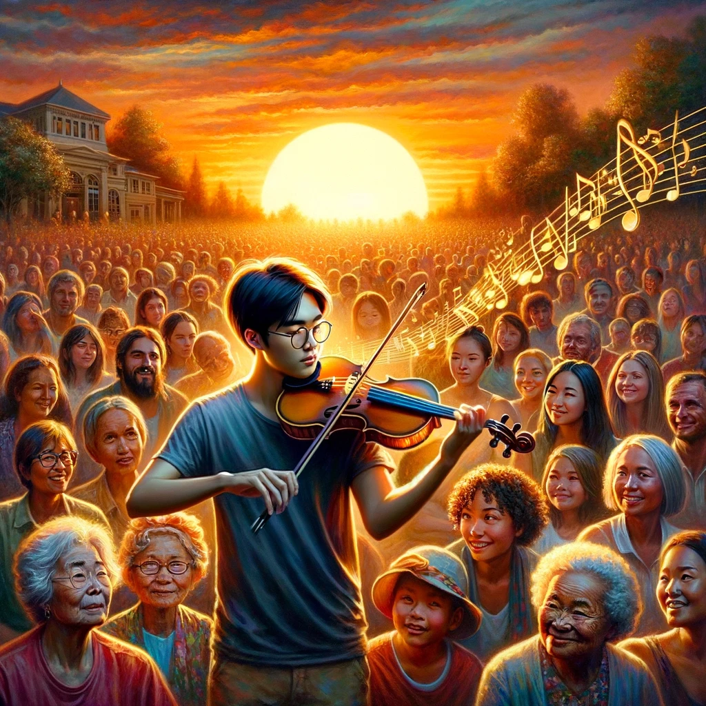

# Violin Literature

{: style="float: left"}
*Մι∩z•thedev* · [Follow](mailto:vinz.thedev@gmail.com)
Published in Random Think · 6 min read · 1 day ago
___
👏65k 💬321 🔖 ⤴️
___

1. Recommendations de lecture
2. L'attrait remarquable du violon
3. L'interprétation du violon solo et le dialogue musical
4. Le violon thérapeutique
5. De simples bouts de bois collés ?
6. Harmonique ou mélodique ?

Je vous livre une liste de lecture musicalement inspirante, de fait fortement centrée autour de l'instrument emblématique de l'orchestre, tant fascinant, qu'émouvant : le Violon. 

Il y a du romancé, de l'historique, du biographique, du théorique.

Vous y découvrirez non seulement les coulisses de la création musicale et de l'interprétation mais aussi les aspirations, les luttes et les réflexions des musiciens et des compositeurs. Ces récits mettent en lumière la quête incessante de beauté, de vérité, et de connexion spirituelle à travers la musique.

- Le violoniste, Mechtild Borrmann
- Un coeur en silence, Blanca Busquets
- Le violon noir, Maxence Fermine
- Quatuor, Anna Enquist
- Le stradivarius de Goebbels, Yoann Iacono
- La forêt aux violons, Cyril Gley
- Les violons du roi, Jean Diwo
- Moi, Milanollo, fils de Stradivarius, Jean Diwo
- Âme brisée, Akira Mizubayashi
- Reine de coeur, Akira Mizubayashi
- Suite inoubliable, Akira Mizubayashi
- Quand la musique fait l'histoire, Hélène Daccord
- Au coeur de l'orchestre, Christian Merlin
- De la musique, Conversations avec Seiji Ozawa, Haruki Murakami
- L'harmonie expliquée aux enfants, Jacques Amblard

## 2. L'attrait remarquable du violon

La sonorité unique du violon, capable d'évoquer une gamme d'émotions allant de la mélancolie profonde à la joie exubérante, semble en effet se connecter directement à l'âme, transcendant les barrières de la langue, de la culture, et même de la connaissance musicale.

La capacité du violon à exercer un attrait physique et émotionnel même sur ceux qui ne sont pas familiers avec la musique classique peut être attribuée à plusieurs facteurs. Sa sonorité, proche de la tessiture de la voix humaine, peut évoquer une impression de chant et d'expression humaine directe. Cette proximité avec la voix humaine facilite une connexion émotionnelle intuitive entre l'auditeur et l'instrument.

La musique classique, souvent décrite comme une nourriture spirituelle, offre une riche palette d'expressions émotionnelles et de réflexions philosophiques. Les compositeurs de musique classique ont souvent investi une quantité considérable de passion dans leurs œuvres, s'inspirant de leurs expériences personnelles, de la littérature, de la nature, et des idéaux esthétiques et philosophiques de leur époque. Leur but était non seulement d'explorer et d'exprimer la condition humaine mais aussi de toucher et d'élever l'esprit de l'auditeur.

## 3. L'interprétation du violon solo et le dialogue musical

Les meilleurs interprètes du violon se distinguent par leur capacité à transcender la technique pure pour communiquer directement avec leur auditoire. Ils parviennent à "survoler" l'ensemble orchestral non par domination, mais par une intégration subtile et une compréhension profonde de la partition, mettant en valeur le dialogue entre le violon solo et le reste de l'orchestre.

Dans un orchestre, les violons dialoguent souvent avec les autres familles d'instruments en jouant des thèmes qui sont ensuite repris, modifiés, ou contestés par d'autres sections. Ce dialogue crée une dynamique musicale riche et variée, où tensions et résolutions jouent un rôle central. Les moments de tension musicale, suivis de leur résolution, imitent les cycles émotionnels humains, créant une expérience d'écoute profondément satisfaisante et cathartique.

La musique, et le violon en particulier, touchent quelque chose de fondamental en nous : notre désir d'expression, de connexion et de transcendance.

##  4. Le violon thérapeutique
  
Dans "Âme brisée" d'Akira Mizubayashi et "Le violoniste" de Mechtild Borrmann, la musique émerge non seulement comme un refuge pour l'âme mais aussi comme un puissant vecteur de guérison face aux traumas transgénérationnels. Ces œuvres mettent en lumière la capacité de la musique à transcender les barrières du temps, de la langue et de la douleur, offrant une forme unique de thérapie qui permet d'explorer, d'exprimer et finalement d'atténuer les souffrances enfouies.

De plus, la musique crée un espace de partage et d'écoute mutuelle, essentiel dans le processus de guérison. En performant ou en écoutant la musique ensemble, les individus peuvent ressentir une solidarité et une compréhension mutuelle qui brisent l'isolement souvent associé au trauma. Cette expérience partagée peut aider à restaurer le sentiment d'appartenance et d'identité, éléments cruciaux dans la reconstruction de soi après des expériences traumatisantes.

Enfin, la capacité de la musique à évoquer des souvenirs et des émotions spécifiques peut jouer un rôle crucial dans le travail de deuil et de réconciliation avec le passé. En résonnant avec les expériences personnelles et familiales, la musique peut aider à revisiter et à recontextualiser les souvenirs douloureux, facilitant un processus de guérison où les individus apprennent à accepter et à intégrer leurs expériences passées dans leur récit de vie.

Ainsi, à travers "Âme brisée" et "Le violoniste", la musique est révélée comme une forme de thérapie capable de transcender le temps et la souffrance, offrant une voie vers la guérison des blessures transgénérationnelles. Par sa capacité unique à toucher l'âme et à exprimer l'indicible, la musique devient un outil essentiel dans le voyage vers la réconciliation et la paix intérieure.

# 5. De simples bouts de bois collés ?

Les ouvrages "La forêt aux violons" de Cyril Gley et "Les violons du roi" de Jean Diwo plongent le lecteur dans le monde fascinant de la lutherie, mettant en lumière la dévotion presque mystique des grands facteurs de violons, tels que Antonio Stradivari. Ces récits explorent non seulement la quête incessante de la beauté idéale dans la fabrication de violons mais aussi la destinée de ces instruments, conçus pour transcender le temps et toucher les âmes à travers les générations.

La dévotion des luthiers comme Stradivari ne réside pas seulement dans leur métier mais dans une quête profonde de perfection, où chaque violon est l'expression d'une recherche d'absolu. Cette quête commence avec le choix minutieux du bois, souvent évoqué dans "La forêt aux violons", où la forêt n'est pas seulement un réservoir de matériaux mais un espace sacré, dont les arbres sont sélectionnés pour leur capacité à résonner avec l'âme humaine. Ce respect profond pour la matière première est le premier pas vers la création d'un instrument capable de transcender les simples notes pour atteindre l'essence même de la musique.

Dans "Les violons du roi", cette dévotion est amplifiée par le contexte historique et culturel dans lequel ces instruments sont créés. Les luthiers de la Cremona du XVIIe siècle ne travaillaient pas seulement pour leur subsistance mais étaient animés par une mission : offrir à la royauté et à la noblesse, puis au monde, des instruments d'une beauté et d'une sonorité inégalées. Cette quête de l'idéal de beauté se traduit par une attention méticuleuse portée à chaque détail de la fabrication, de la forme de la caisse de résonance à la courbe parfaite du chevalet, chaque élément étant conçu pour harmoniser esthétique et sonorité.

La beauté recherchée par Stradivari et ses contemporains n'est pas seulement physique ou acoustique ; elle est aussi spirituelle. Ils aspirent à créer des violons capables de parler directement à l'âme, croyant que la musique a le pouvoir de purifier les cœurs et d'élever l'esprit. Cette spiritualité inhérente à leur art fait des violons non de simples objets, mais des vecteurs d'émotion pure, des ponts entre le terrestre et le divin.

La destinée de cette beauté est double. D'une part, elle est destinée à l'élite, aux rois et aux courts qui reconnaissent la valeur de ces chefs-d'œuvre et peuvent les préserver pour les générations futures. D'autre part, elle est offerte à tous ceux capables de ressentir la profondeur et l'émotion véhiculées par leur son. Les violons de Stradivari et d'autres maîtres luthiers transcendent leur époque et leur origine sociale pour devenir un patrimoine universel, touchant les cœurs bien au-delà des salles de concert et des palais.

En fin de compte, la dévotion des grands facteurs de violon n'est pas seulement à leur art mais à l'humanité elle-même. Leur recherche de l'idéal de beauté et leur désir d'offrir cette beauté au monde révèlent une profonde compréhension du pouvoir unificateur et transcendant de la musique. Les violons qu'ils créent ne sont pas de simples instruments ; ils sont des témoins de l'aspiration humaine à la beauté, à l'expression et à la connexion spirituelle, destinés à émouvoir et inspirer pour l'éternité.

# 6. Harmonique ou mélodique ?

"L'harmonie expliquée aux enfants" de Jacques Amblard est une initiation à la théorie musicale qui nous explique comment les accords et les structures musicales se fondent sur des principes mathématiques précis. Amblard démontre que l'harmonie, loin d'être un concept abstrait, repose sur des rapports numériques entre les fréquences sonores, qui déterminent pourquoi certaines notes semblent naturellement s'accorder ensemble. Le livre révèle la beauté intrinsèque de la musique comme un équilibre entre art et science, soulignant comment les lois mathématiques sous-jacentes façonnent l'harmonie musicale.

Concernant le violon, traditionnellement perçu comme un instrument mélodique, il peut aussi explorer et exprimer la dimension harmonique de la musique grâce à plusieurs techniques avancées. Bien que le violon soit conçu pour jouer principalement une ligne mélodique à la fois, l'utilisation créative de techniques avancées lui permet de suggérer ou de réaliser des harmonies complexes.

- _Gammes et Arpèges_. Par l'exécution rapide de gammes et d'arpèges, le violoniste peut suggérer une progression harmonique. Bien que ces éléments soient mélodiques en nature, leur agencement rapide et leur sélection selon certaines tonalités peuvent évoquer une texture harmonique.
- _Bariolages_. Cette technique consiste à alterner rapidement entre différentes cordes en utilisant des motifs mélodiques répétitifs, créant une illusion d'harmonie à travers la superposition rapide de notes.
- _Jeu en Double et Triple Cordes_. Le violon peut jouer deux ou trois notes simultanément grâce à l'utilisation de double ou de triple cordes. Cette technique permet de produire des accords, enrichissant la texture musicale avec une dimension harmonique directe.
- _Accords et Accords Brisés_. Bien que plus exigeants techniquement, les accords joués sur un violon, où plusieurs notes sont jouées en même temps ou en succession rapide, offrent une expression claire de l'harmonie. Les accords brisés, où les notes d'un accord sont jouées séquentiellement plutôt que simultanément, permettent également de construire une texture harmonique.
- _Pizzicato Polyphonique_. Bien que moins courant, le pizzicato (pincer les cordes avec les doigts plutôt que d'utiliser l'archet) peut être utilisé pour jouer plusieurs notes en succession rapide ou simultanément, apportant une couleur harmonique.
- _Techniques Étendues_. L'utilisation de techniques étendues, comme les harmoniques (où le violoniste touche légèrement la corde à certains points pour créer des sons aigus et cristallins) peut également enrichir la palette harmonique du violon.

En combinant ces techniques, un violoniste peut non seulement exécuter des mélodies complexes mais aussi tisser des textures riches et variées qui empruntent à la sphère harmonique. Ces capacités font du violon un instrument extrêmement versatile, capable de contribuer à l'harmonie dans un contexte solo ou en ensemble, tout en restant fidèle à son essence mélodique.
